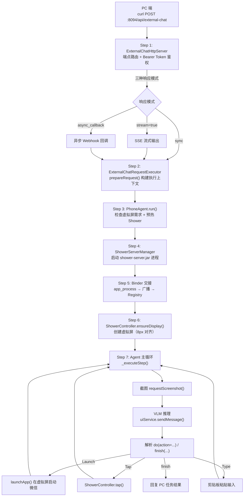
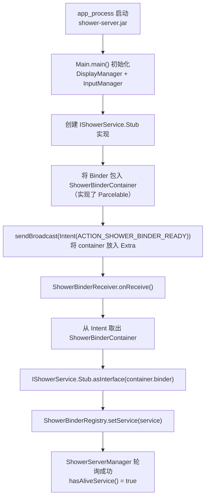
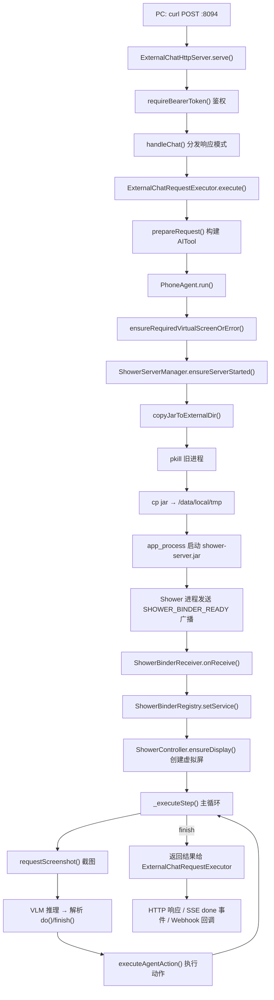

# Walkthrough: Phone Agent 从远程指令到虚拟屏幕操控

> **场景：** 用户在 PC 端执行一条 curl 命令：`POST http://手机IP:8094/api/external-chat`，内容是"帮我打开微信发一条消息给张三"。手机上的 ExternalChatHttpServer 接收到这条指令后，启动 PhoneAgent，Agent 在虚拟屏幕（Shower）中打开微信，通过 VLM（视觉语言模型）反复截图识别 UI，执行 Launch → Tap → Type 等操作，最终回复"消息已发送"。
>
> **阅读方式：** 左边打开这篇文档，右边打开 Android Studio。每一步都标注了文件路径和行号，跟着跳转。
>
> **预计时间：** 40-50 分钟。Binder 交接那一节需要多花时间，它是整个系统最"Android 系统级"的部分。

---

## 全链路总览



---

## Step 1: HTTP 服务器接收远程指令

```
app/src/main/java/com/ai/assistance/operit/integrations/http/ExternalChatHttpServer.kt
```

ExternalChatHttpServer 继承自 NanoHTTPD，绑定在 `0.0.0.0:8094`（端口由 `ExternalHttpApiPreferences` 管理，默认值在 L103 定义）。服务在 `AIForegroundService.ensureRunningForExternalHttp()`（L439）中被实例化并启动。

**端点路由（L72-84）：**

```kotlin
override fun serve(session: IHTTPSession): Response {
    return when {
        session.method == Method.OPTIONS -> handleOptions(session)              // CORS 预检
        session.uri == HEALTH_PATH && session.method == Method.GET -> handleHealth(session)  // GET /api/health
        session.uri == CHAT_PATH && session.method == Method.POST -> handleChat(session)     // POST /api/external-chat
        else -> jsonResponse(Response.Status.NOT_FOUND, ...)
    }
}
```

**Bearer Token 鉴权（L363-396）：**

所有非 OPTIONS 请求都要先过 `requireBearerToken()`。Token 存储在 `ExternalHttpApiPreferences`，首次启动时通过 `ensureBearerToken()` 自动生成一个 UUID 写入。校验逻辑如下：

```kotlin
private fun requireBearerToken(session: IHTTPSession): Response? {
    val expectedToken = preferences.getBearerToken().trim()
    val authorization = session.headers.entries
        .firstOrNull { it.key.equals("authorization", ignoreCase = true) }
        ?.value?.trim().orEmpty()
    val actualToken = if (authorization.startsWith("Bearer ", ignoreCase = true)) {
        authorization.substringAfter(' ').trim()
    } else { "" }
    return if (actualToken == expectedToken) null   // null 表示鉴权通过
    else jsonResponse(Response.Status.UNAUTHORIZED, ...)
}
```

**三种响应模式（L148-224）：**

鉴权通过后，`handleChat()` 根据请求中的 `stream` 和 `response_mode` 字段分叉：

| 条件 | 响应方式 | 说明 |
|------|---------|------|
| `stream=true` | SSE 流（text/event-stream）| 实时推送 delta 事件 |
| `response_mode=async_callback` | HTTP 202 立即返回，完成后 POST callback_url | 适合长任务 |
| 默认（sync） | `runBlocking` 阻塞等待，返回完整结果 | 最简单 |

SSE 事件类型（L530-542 常量）：`start` / `delta` / `done` / `error`，每个事件都写入 `event:` 和 `data:` 行，符合 W3C SSE 规范。

---

## Step 2: 请求模型与执行器

```
app/src/main/java/com/ai/assistance/operit/integrations/externalchat/ExternalChatModels.kt
app/src/main/java/com/ai/assistance/operit/integrations/externalchat/ExternalChatRequestExecutor.kt
```

**请求数据模型（ExternalChatModels.kt L54-110）：**

```kotlin
@Serializable
data class ExternalChatHttpRequest(
    val message: String? = null,          // 用户指令文本（必填）
    val responseMode: String = "sync",    // sync / async_callback
    val stream: Boolean = false,          // 是否 SSE 流式
    val callbackUrl: String? = null,      // async_callback 时必填
    val chatId: String? = null,           // 指定已有会话 ID
    val createNewChat: Boolean = false,   // 是否强制新建对话
    val showFloating: Boolean = false,    // 是否显示悬浮窗
    val stopAfter: Boolean = false,       // 完成后停止聊天服务
    ...
)
```

**prepareRequest()（ExternalChatRequestExecutor.kt L115-212）：**

这是把 HTTP 请求参数转化为 AI 对话上下文的核心方法，执行顺序：

1. 如果 `showFloating=true`，先调用 `chatTool.startChatService()` 弹出悬浮窗
2. 如果 `createNewChat=true`，调用 `chatTool.createNewChat()` 创建新对话
3. 构造 `send_message_to_ai` AITool，携带 message 和 chatId
4. 若 `stopAfter=true`，注册一个 `cleanupAction` 在完成后关闭服务

关键设计：`prepareRequest()` 返回的是一个密封类 `PreparationResult`，要么是 `Ready`（含 chatTool + sendTool），要么是 `Failed`（含错误信息）。这让调用方可以用 `when` 清晰地处理两种情况。

---

## Step 3: PhoneAgent 初始化与运行准备

```
app/src/main/java/com/ai/assistance/operit/core/tools/agent/PhoneAgent.kt
```

PhoneAgent 是整个自动化的大脑，它的构造参数决定了行为模式：

```kotlin
class PhoneAgent(
    private val context: Context,
    private val config: AgentConfig,         // maxSteps: Int = 20
    private val uiService: AIService,        // VLM 推理服务
    private val actionHandler: ActionHandler,
    val agentId: String = "default",
    private val cleanupOnFinish: Boolean = (agentId != "default"),
) {
    // agentId != "default" 时，requiresVirtualScreen = true
    private val requiresVirtualScreen: Boolean = agentId.isNotBlank() && agentId != "default"
    private val isMainScreenAgent: Boolean = agentId.isBlank() || agentId == "default"
```

**关键设计：agentId 控制是否使用虚拟屏**

当从 PC 远程触发时，Agent 会被分配一个非 "default" 的 agentId（例如基于 chatId 生成），这时 `requiresVirtualScreen = true`，Agent 将在独立的虚拟屏中运行而不干扰用户的主屏幕。

**run() 启动序列（L355-593）：**

```kotlin
suspend fun run(task: String, systemPrompt: String, ...): String {
    // 1. 向 PhoneAgentJobRegistry 注册当前 Job，支持外部取消
    PhoneAgentJobRegistry.register(agentId, job)

    // 2. 检查虚拟屏需求：若需要虚拟屏但 ADB/Shizuku 权限不足，直接报错
    val requiredVirtualScreenError = ensureRequiredVirtualScreenOrError()
    if (requiredVirtualScreenError != null) return requiredVirtualScreenError

    // 3. 预热主屏 Shower（如果是主屏 Agent 且有 ADB 权限）
    val mainScreenShowerReady = prewarmMainScreenShowerIfPossible()

    // 4. 预热虚拟屏 Shower（如果需要虚拟屏）
    val (prewarmedShowerDisplay, prewarmError) = prewarmShowerIfNeeded(hasShowerDisplay, targetApp)

    // 5. 初始化覆盖层 UI（进度指示器 or 虚拟屏预览窗）
    val showerOverlay = VirtualDisplayOverlay.getInstance(context, agentId)

    // 6. 启动主循环
    var result = _executeStep(task, isFirst = true)
    while (!result.finished && _stepCount < config.maxSteps) {
        result = _executeStep(null, isFirst = false)
    }
}
```

---

## Step 4: ShowerServerManager 启动 jar 进程

```
showerclient/src/main/java/com/ai/assistance/showerclient/ShowerServerManager.kt
```

这是整个系统最底层、最"Android 系统级"的部分。Shower 是一个独立的 Java 进程，以 `app_process` 方式运行在 `/data/local/tmp` 目录下，拥有比普通应用更高的系统权限（shell 用户），可以创建虚拟屏幕、注入触摸/按键事件。

`ensureServerStarted()` 的六步流程（L32-111）：

```kotlin
suspend fun ensureServerStarted(context: Context): Boolean {
    // 步骤 0：如果 Registry 里已经有存活的 Binder，直接复用
    if (ShowerBinderRegistry.hasAliveService()) return true

    val runner = ShowerEnvironment.shellRunner  // 注入的 Shell 执行器

    // 步骤 1：从 assets 复制 shower-server.jar 到 /sdcard/Download/Operit/
    val jarFile = copyJarToExternalDir(appContext)

    // 步骤 2：pkill 杀掉旧进程
    runner.run("pkill -f com.ai.assistance.shower.Main || true", ShellIdentity.DEFAULT)

    // 步骤 3：清理 /data/local/tmp 下的旧 jar 和日志
    runner.run("rm -f /data/local/tmp/shower-server.jar /data/local/tmp/shower.log || true",
               ShellIdentity.DEFAULT)

    // 步骤 4：将 jar 从 /sdcard 复制到 /data/local/tmp（用 SHELL 身份，使文件归属 shell 用户）
    val copyResult = runner.run(
        "cp ${jarFile.absolutePath} /data/local/tmp/shower-server.jar",
        ShellIdentity.SHELL   // <-- 注意：必须是 SHELL 身份，不能是 DEFAULT
    )

    // 步骤 5：用 app_process 启动 jar，在后台运行
    val startCmd = "CLASSPATH=/data/local/tmp/shower-server.jar " +
                   "app_process / com.ai.assistance.shower.Main " +
                   "${appContext.packageName} &"
    runner.run(startCmd, ShellIdentity.SHELL)

    // 步骤 6：轮询最多 10 秒（50 次 × 200ms），等待 Binder 广播到达
    for (attempt in 0 until 50) {
        delay(200)
        if (ShowerBinderRegistry.hasAliveService()) return true
    }
    return false
}
```

**为什么用 `app_process` 而不是普通的 `Runtime.exec()`？**

`app_process` 是 Android 系统自带的工具，它能初始化完整的 Android Runtime（ART）和 Binder 线程池，让 jar 内的代码可以：

- 使用 `android.*` 系统 API（如 `DisplayManager`、`InputManager`）
- 创建 Binder 服务并暴露给其他进程
- 以 shell 用户身份执行需要 `INJECT_EVENTS` 等特权的操作

普通的 `Runtime.exec()` 或 `ProcessBuilder` 启动的进程没有这些能力。

---

## Step 5: Binder 交接流程（核心难点）

这是整个系统最独特的架构设计，值得单独细讲。

```
showerclient/src/main/java/com/ai/assistance/shower/IShowerService.java      （接口定义）
showerclient/src/main/java/com/ai/assistance/showerclient/ShowerBinderRegistry.kt  （注册中心）
app/src/main/java/com/ai/assistance/operit/core/tools/agent/ShowerBinderReceiver.kt （广播接收）
app/src/main/java/com/ai/assistance/operit/core/tools/agent/ShowerController.kt    （app 层适配）
app/src/main/java/com/ai/assistance/operit/core/tools/system/shower/OperitShowerShellRunner.kt （Shell 桥接）
```

### 为什么不用 bindService()？

通常 Android 进程间通信用 `bindService()`——Service 把 Binder 传回 `onServiceConnected()`。但 Shower 进程是通过 Shell 命令启动的，它不是 AndroidManifest 注册的 Service，所以 `bindService()` 根本不知道它的存在。

Operit 选用了另一种方式：**通过广播传递 Binder**。

### 广播传递 Binder 的完整时序



### IShowerService：手写的 AIDL 接口（L51-130）

```
showerclient/src/main/java/com/ai/assistance/shower/IShowerService.java
```

这个接口**没有使用 AIDL 工具自动生成**，而是完全手写的 Stub/Proxy 模式，这是一个罕见但合法的做法——好处是可以精确控制事务码（transaction code）的分配：

```java
public interface IShowerService extends IInterface {
    int  ensureDisplay(int width, int height, int dpi, int bitrateKbps) throws RemoteException;
    void destroyDisplay(int displayId) throws RemoteException;
    void launchApp(String packageName, int displayId) throws RemoteException;
    void tap(int displayId, float x, float y) throws RemoteException;
    void swipe(int displayId, float x1, float y1, float x2, float y2, long durationMs) throws RemoteException;
    void touchDown/Move/Up(int displayId, float x, float y) throws RemoteException;
    void injectKey(int displayId, int keyCode) throws RemoteException;
    byte[] requestScreenshot(int displayId) throws RemoteException;
    void setVideoSink(int displayId, IBinder sink) throws RemoteException;

    abstract class Stub extends Binder implements IShowerService {
        // 事务码从 FIRST_CALL_TRANSACTION 开始顺序分配
        static final int TRANSACTION_ensureDisplay = IBinder.FIRST_CALL_TRANSACTION;      // 1
        static final int TRANSACTION_tap           = IBinder.FIRST_CALL_TRANSACTION + 3;  // 4
        static final int TRANSACTION_requestScreenshot = IBinder.FIRST_CALL_TRANSACTION + 9; // 10
        // ...
    }
}
```

### ShowerBinderReceiver：接收广播（app 层）

```kotlin
class ShowerBinderReceiver : BroadcastReceiver() {
    override fun onReceive(context: Context, intent: Intent) {
        if (intent.action != ACTION_SHOWER_BINDER_READY) return
        // 1. 从 Intent Extra 取出 Parcelable 容器
        val container = intent.getParcelableExtra<ShowerBinderContainer>(EXTRA_BINDER_CONTAINER)
        // 2. 取出 IBinder，转成 IShowerService 代理对象
        val service = container?.binder?.let { IShowerService.Stub.asInterface(it) }
        // 3. 存入全局 Registry
        ShowerBinderRegistry.setService(service)
    }
    companion object {
        const val ACTION_SHOWER_BINDER_READY = "com.ai.assistance.operit.action.SHOWER_BINDER_READY"
    }
}
```

### ShowerBinderRegistry：全局单例持有 Binder

```kotlin
// showerclient/ShowerBinderRegistry.kt
object ShowerBinderRegistry {
    @Volatile
    private var service: IShowerService? = null

    fun setService(newService: IShowerService?) { service = newService }
    fun getService(): IShowerService? = service
    fun hasAliveService(): Boolean = service?.asBinder()?.isBinderAlive == true
}
```

`@Volatile` 保证多线程可见性。`isBinderAlive` 是 Android Binder 框架提供的原生检测，当 shower 进程崩溃时会返回 false，触发自动重启逻辑。

### app 层 ShowerController：ConcurrentHashMap 多 Agent 实例

```kotlin
// app/core/tools/agent/ShowerController.kt L17
object ShowerController {
    private val instances = ConcurrentHashMap<String, ClientShowerController>()

    fun getInstance(agentId: String): ClientShowerController =
        instances.getOrPut(agentId) { ClientShowerController() }
}
```

多个 PhoneAgent 可以并发运行（不同 agentId），每个有独立的 `ClientShowerController` 实例，各自持有独立的 `virtualDisplayId`，但共享同一个底层 Binder 连接（通过 `companion object` 中的 `binderService`）。

### OperitShowerShellRunner：Shell 桥接

```kotlin
// app/core/tools/system/shower/OperitShowerShellRunner.kt
object OperitShowerShellRunner : ShellRunner {
    override suspend fun run(command: String, identity: ShellIdentity): ShellCommandResult {
        val appIdentity = when (identity) {
            ShellIdentity.SHELL -> AppShellIdentity.SHELL
            ShellIdentity.ROOT  -> AppShellIdentity.ROOT
            else                -> AppShellIdentity.DEFAULT
        }
        val result = AndroidShellExecutor.executeShellCommand(command, appIdentity)
        return ShellCommandResult(success = result.success, stdout = result.stdout, ...)
    }
}
```

`ShowerServerManager` 是 showerclient 库中的代码，它不能直接调用 app 的 Shell 执行器。`OperitShowerShellRunner` 实现了库定义的 `ShellRunner` 接口，作为适配器桥接两侧。初始化时通过 `ShowerEnvironment.shellRunner = OperitShowerShellRunner` 注入。

---

## Step 6: 创建虚拟屏幕

```
showerclient/src/main/java/com/ai/assistance/showerclient/ShowerController.kt L230-323
```

Binder 交接完成后，Agent 调用 `ShowerController.ensureDisplay()` 创建虚拟屏幕。

**8px 对齐（L252-256）：**

```kotlin
val alignedWidth = width and -8   // 等价于 width & 0xFFFFFFF8，向下对齐到 8 的倍数
val alignedHeight = height and -8
```

视频编解码器（特别是 H.264/HEVC）要求宽高是宏块（macroblock）大小的整数倍，通常是 16px 或 8px。强制对齐避免编码器产生绿边、花屏等问题。

**创建流程：**

```kotlin
suspend fun doEnsure(service: IShowerService): Boolean {
    val existingId = virtualDisplayId
    // 如果已有虚拟屏且尺寸一致，只需重新挂载 VideoSink
    if (existingId != null && videoWidth == targetWidth && videoHeight == targetHeight) {
        service.setVideoSink(existingId, videoSink.asBinder())
        return true
    }
    // 销毁旧虚拟屏
    if (existingId != null) service.destroyDisplay(existingId)

    // 创建新虚拟屏，返回 displayId（失败返回 -1）
    val id = service.ensureDisplay(targetWidth, targetHeight, dpi, bitrate)
    if (id < 0) return false

    virtualDisplayId = id
    // 注册 VideoSink：Shower 服务端会持续将虚拟屏画面推送到这个 Sink
    service.setVideoSink(id, videoSink.asBinder())
    return true
}
```

**VideoSink 回调：**

```kotlin
private val videoSink = object : IShowerVideoSink.Stub() {
    override fun onVideoFrame(data: ByteArray) {
        // 如果没有 handler 就先缓存（最多 120 帧），等 handler 注册后回放
        synchronized(binaryLock) {
            handler?.invoke(data) ?: earlyBinaryFrames.addLast(data)
        }
    }
}
```

这是一个跨进程回调——Shower 服务端通过 Binder 把每一帧视频数据（JPEG 或原始字节）推送过来，客户端收到后可以渲染到悬浮窗预览，或用于截图。

---

## Step 7: Agent 主循环与 VLM 推理

```
app/src/main/java/com/ai/assistance/operit/core/tools/agent/PhoneAgent.kt L602-660
app/src/main/java/com/ai/assistance/operit/core/config/FunctionalPrompts.kt L563-628
```

### _executeStep()：单步执行（L602-660）

每一步的完整流程：

```kotlin
private suspend fun _executeStep(userPrompt: String?, isFirst: Boolean): StepResult {
    _stepCount++

    // 1. 截图：调用 ShowerController.requestScreenshot()，同步等待 Binder 返回字节数组
    val screenshotLink = actionHandler.captureScreenshotForAgent()

    // 2. 组装用户消息：首轮包含任务描述 + 截图；后续轮只有截图
    val userMessage = if (isFirst) "$userPrompt\n\n$screenInfo" else "** Screen Info **\n\n$screenInfo"
    _contextHistory.add("user" to userMessage)

    // 3. 调用 VLM 推理（流式收集）
    val responseStream = uiService.sendMessage(
        context = context,
        chatHistory = _contextHistory.toList().toPromptTurns(),
        enableThinking = false,
        stream = true,
    )
    val fullResponse = responseStream.collectToString()

    // 4. 解析 <think>...</think><answer>...</answer> 结构
    val (thinking, answer) = parseThinkingAndAction(fullResponse)
    _contextHistory.add("assistant" to "<think>$thinking</think><answer>$answer</answer>")

    // 5. 移除历史中的图片（节省 token）
    actionHandler.removeImagesFromLastUserMessage(_contextHistory)

    // 6. 解析动作指令
    val parsedAction = parseAgentAction(answer)
    return when (parsedAction.metadata) {
        "finish" -> StepResult(success=true, finished=true, ...)
        "do"     -> {
            val execResult = actionHandler.executeAgentAction(parsedAction)
            StepResult(success=execResult.success, finished=execResult.shouldFinish, ...)
        }
        else -> StepResult(success=false, finished=true, ...)
    }
}
```

### Agent 系统提示词（FunctionalPrompts.kt L563-628）

`UI_AUTOMATION_AGENT_PROMPT` 定义了 Agent 的动作语法，VLM 必须输出这种格式：

```
do(action="Launch", app="微信")
do(action="Tap", element=[500,300])
do(action="Type", text="你好")
do(action="Swipe", start=[500,800], end=[500,200])
do(action="Back")
do(action="Home")
do(action="Wait", duration="2 seconds")
do(action="Take_over", message="请输入验证码")
finish(message="消息已发送给张三")
```

坐标系统统一使用归一化坐标（0-999），与屏幕实际分辨率无关，由 `parseRelativePoint()` 负责换算。

---

## Step 8: 执行具体动作

```
app/src/main/java/com/ai/assistance/operit/core/tools/agent/PhoneAgent.kt L960-1145
```

`executeAgentAction()` 是一个大型 `when` 表达式，处理所有动作类型：

**Launch（L966-1030）：**

```kotlin
"Launch" -> {
    val packageName = resolveAppPackageName(app)  // app 名 → 包名
    if (showerCtx.isAdbOrHigher && !isMainScreenAgent()) {
        // 虚拟屏模式：在指定 displayId 上启动 app
        val created = ShowerController.ensureDisplay(agentId, context, width, height, dpi)
        val launched = ShowerController.launchApp(agentId, packageName)
        // 更新覆盖层显示的 app 名称
        VirtualDisplayOverlay.getInstance(context, agentId).updateCurrentAppPackageName(packageName)
    } else {
        // 主屏模式：通过 ADB start_app 工具启动
        aiToolManager.executeTool(AITool("start_app", listOf(ToolParameter("package_name", packageName))))
    }
}
```

**Tap（L1031-1046）：**

```kotlin
"Tap" -> {
    val (x, y) = parseRelativePoint(element)  // 归一化坐标 → 实际像素
    if (showerCtx.canUseShowerForInput) {
        ShowerController.tap(agentId, x, y)   // 通过 Binder 注入触摸事件
    } else {
        toolImplementations.tap(AITool("tap", listOf(x, y)))  // ADB tap
    }
    delay(POST_NON_WAIT_ACTION_DELAY_MS)  // 等待 UI 响应
}
```

**Type（L1047-1080）：输入文字的"剪贴板技巧"**

```kotlin
"Type" -> {
    // 1. Ctrl+A 全选 → Delete 清空现有内容
    ShowerController.keyWithMeta(agentId, KEYCODE_A, META_CTRL_ON)
    ShowerController.key(agentId, KEYCODE_DEL)

    // 2. 将目标文字写入系统剪贴板
    clipboard.setPrimaryClip(ClipData.newPlainText("operit_input", text))
    delay(100)

    // 3. Ctrl+V 粘贴
    ShowerController.key(agentId, KEYCODE_PASTE)
}
```

为什么不直接逐字符注入键盘事件？因为 `InputManager.injectInputEvent()` 对中文字符支持差（中文需要 IME），而剪贴板粘贴对任何语言都有效。

---

## Step 9: 截图与请求同步

```
showerclient/src/main/java/com/ai/assistance/showerclient/ShowerController.kt L143-155
```

```kotlin
suspend fun requestScreenshot(timeoutMs: Long = 3000L): ByteArray? =
    withContext(Dispatchers.IO) {
        val service = getBinder() ?: return@withContext null
        val id = virtualDisplayId ?: return@withContext null
        try {
            withTimeout(timeoutMs) {
                service.requestScreenshot(id)   // 跨进程同步调用，Shower 服务端截图后返回字节数组
            }
        } catch (e: Exception) {
            ShowerLog.e(TAG, "requestScreenshot failed for $id", e)
            null
        }
    }
```

注意：`requestScreenshot()` 是一个**同步 Binder 调用**，调用线程会阻塞直到 Shower 进程截图完成并序列化返回。所以必须在 `Dispatchers.IO` 上执行，而不能在主线程调用。

---

## 完整调用链回顾



---

## 涉及文件

| 文件 | 所在模块 | 核心职责 |
|------|---------|---------|
| `integrations/http/ExternalChatHttpServer.kt` | app | NanoHTTPD HTTP 服务器，处理端点路由和三种响应模式 |
| `integrations/externalchat/ExternalChatModels.kt` | app | 请求/响应数据模型定义 |
| `integrations/externalchat/ExternalChatRequestExecutor.kt` | app | 请求预处理，构建 AI 对话上下文 |
| `data/preferences/ExternalHttpApiPreferences.kt` | app | HTTP 服务配置（端口、Bearer Token） |
| `integrations/http/ExternalChatHttpAutoStarter.kt` | app | 服务自动启动逻辑 |
| `core/tools/agent/PhoneAgent.kt` | app | AI 自动化 Agent 主体，包含主循环和动作执行 |
| `core/config/FunctionalPrompts.kt` | app | Agent 系统提示词，定义 do()/finish() 动作语法 |
| `core/tools/agent/PhoneAgentJobRegistry.kt` | app | 按 agentId 管理 Coroutine Job，支持外部取消 |
| `core/tools/agent/ShowerController.kt` | app | app 层适配器，ConcurrentHashMap 管理多 Agent 实例 |
| `core/tools/agent/ShowerBinderReceiver.kt` | app | 广播接收器，接收 Shower Binder 并存入 Registry |
| `core/tools/system/shower/OperitShowerShellRunner.kt` | app | Shell 桥接，连接 showerclient 库与 app 的 Shell 执行器 |
| `api/chat/AIForegroundService.kt` | app | 前台服务，实例化并启动 ExternalChatHttpServer |
| `integrations/intent/ExternalChatReceiver.kt` | app | Intent 广播接口（adb 命令行触发） |
| `showerclient/.../IShowerService.java` | showerclient | 手写 AIDL Binder 接口，定义所有虚拟屏操作 |
| `showerclient/.../ShowerController.kt` | showerclient | Binder 客户端，封装所有 IPC 调用和重连逻辑 |
| `showerclient/.../ShowerServerManager.kt` | showerclient | Shower 进程生命周期管理（启动/停止） |
| `showerclient/.../ShowerBinderRegistry.kt` | showerclient | 全局单例，持有存活的 IShowerService Binder |

---

## 动手练习

1. **追踪 Bearer Token 的生命周期**：找到 `ExternalHttpApiPreferences.ensureBearerToken()`，看它在什么时机被调用、Token 存储在哪个 SharedPreferences 文件中。尝试用 `adb shell` 模拟一次带错误 Token 的请求，观察日志。

2. **理解 8px 对齐**：在 `ShowerController.ensureDisplay()` 中，把 `width and -8` 改成 `width`，重启服务后尝试创建虚拟屏，观察是否出现画面异常。改回后思考：为什么是 -8 而不是 `width / 8 * 8`？

3. **模拟 Binder 断联重连**：在 Agent 运行过程中，通过 `adb shell pkill -f com.ai.assistance.shower.Main` 手动杀掉 Shower 进程。观察 `ShowerController.getBinder()` 的重连逻辑是否被触发，以及 Agent 是否能自动恢复。关键代码在 `ShowerController.kt` L62-78。

4. **添加新动作类型**：在 `FunctionalPrompts.kt` 的 `UI_AUTOMATION_AGENT_PROMPT` 中新增一个 `do(action="Screenshot")` 指令说明，然后在 `PhoneAgent.executeAgentAction()` 中实现对应的处理逻辑，让 Agent 可以主动截图并保存到文件。

5. **观察 SSE 流式输出**：用 `curl -N` 发送一个 `stream=true` 的请求，观察 SSE 事件流中 `start`、`delta`、`done` 事件的实际格式。找到 `ExternalChatHttpServer` 中写 SSE 事件的代码，对应到实际收到的字节流。

---

## 关联文档

- [Walkthrough: Tool 执行全链路](tool-execution.md) — 理解 AITool / ToolResult 模型，PhoneAgent 中的 `aiToolManager.executeTool()` 走的是同一套机制
- [Walkthrough: App 冷启动到主界面](cold-start.md) — ExternalChatHttpServer 在 `AIForegroundService` 中启动，冷启动文档讲解了前台服务的初始化时序
- [Walkthrough: Shell 权限系统](shell-permission.md) — `ShowerServerManager` 中的 `ShellIdentity.SHELL` 与 `ShellIdentity.DEFAULT` 的区别，以及 `AndroidShellExecutor` 的权限层级
- [Walkthrough: 工作流执行](workflow-execution.md) — PhoneAgent 与工作流的对比：两者都是多步推理循环，但 PhoneAgent 以截图作为每步的"状态观测"
