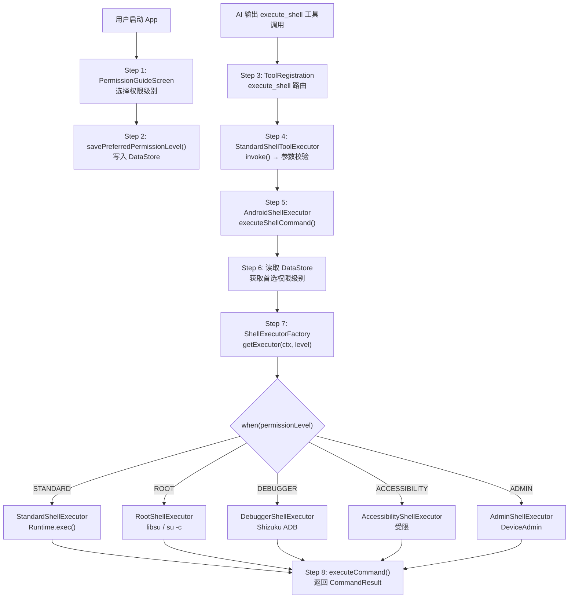

# Walkthrough: Shell 执行与权限分层路由

> **场景：** AI 决定执行一条 Shell 命令 `ls /system/app`。根据用户在启动时选择的权限级别（Standard/Root/Shizuku/...），命令被路由到不同的执行后端。从工具调用到命令执行完毕，经过了哪些代码。
>
> **前置知识：** 建议先读 `tool-execution.md`，了解工具系统的 6 阶段执行管线。本文聚焦 `execute_shell` 工具进入执行后端后的权限路由细节。
>
> **预计时间：** 25-35 分钟。

---

## 全链路总览



---

## Step 1-2: 用户选择权限级别

### PermissionGuideScreen — 6 页引导

```
📂 ui/features/permission/screens/PermissionGuideScreen.kt L83, L376
```

App 首次安装时（`cold-start.md` Step 10 的"门3"），显示权限引导页面。第 6 页是权限级别选择：

```kotlin
// L376: 权限级别页面
PermissionLevelPage(
    selectedLevel = viewModel.uiState.selectedPermissionLevel,
    onLevelSelected = { viewModel.selectPermissionLevel(it) },
    onConfirm = { viewModel.savePermissionLevel() }
)
```

**四个选项：**

| 级别 | 说明 | 需要的条件 |
|------|------|-----------|
| STANDARD | App 沙盒内执行，无额外权限 | 无 |
| ACCESSIBILITY | 无障碍服务（UI 自动化） | 开启无障碍 |
| DEBUGGER | Shizuku ADB 级权限 | Shizuku 运行中 |
| ROOT | 完整 Root 权限 | 设备已 Root |

### 持久化

```
📂 data/preferences/AndroidPermissionPreferences.kt L78
```

```kotlin
suspend fun savePreferredPermissionLevel(permissionLevel: AndroidPermissionLevel) {
    dataStore.edit { preferences ->
        preferences[PREFERRED_PERMISSION_LEVEL] = permissionLevel.name
    }
}

// L104: 同步读取
fun getPreferredPermissionLevel(): AndroidPermissionLevel? {
    val prefs = runBlocking { dataStore.data.first() }
    val level = prefs[PREFERRED_PERMISSION_LEVEL] ?: return null
    return AndroidPermissionLevel.fromString(level)
}
```

---

## Step 3: 工具注册 — execute_shell

```
📂 core/tools/ToolRegistration.kt L74
```

```kotlin
handler.registerTool(
    name = "execute_shell",
    descriptionGenerator = { tool ->
        tool.parameters.find { it.name == "command" }?.value ?: "Shell command"
    },
    executor = { tool ->
        ToolGetter.getShellToolExecutor(context).invoke(tool)
    }
)
```

**注意 `ToolGetter.getShellToolExecutor`（L36）：** 和文件系统工具不同，Shell 工具**不在 ToolGetter 层做权限路由**。它总是返回 `StandardShellToolExecutor`，权限路由在更深层的 `AndroidShellExecutor` 中进行。

```
📂 core/tools/defaultTool/ToolGetter.kt L36
```

```kotlin
fun getShellToolExecutor(context: Context): StandardShellToolExecutor {
    return StandardShellToolExecutor(context)  // 总是 Standard，不按权限分
}
```

---

## Step 4: StandardShellToolExecutor — 参数校验

```
📂 core/tools/defaultTool/standard/StandardShellToolExecutor.kt L18, L25
```

```kotlin
open class StandardShellToolExecutor(private val context: Context) {

    fun invoke(tool: AITool): ToolResult {
        // 参数校验
        val validation = validateParameters(tool)
        if (!validation.isValid) return ToolResult(success = false, error = validation.error)

        val command = tool.parameters.find { it.name == "command" }?.value ?: ""

        // 调用 AndroidShellExecutor（权限路由在这里发生）
        val result = runBlocking {
            AndroidShellExecutor.executeShellCommand(command)
        }

        return ToolResult(
            success = result.success,
            result = StringResultData("stdout: ${result.stdout}\nstderr: ${result.stderr}")
        )
    }

    // L84: 安全校验 — 拒绝危险命令
    fun validateParameters(tool: AITool): ToolValidationResult {
        val command = tool.parameters.find { it.name == "command" }?.value
        if (command.isNullOrBlank()) return invalid("Command cannot be empty")
        if (command.contains("rm -rf")) return invalid("Dangerous command blocked")
        return valid()
    }
}
```

---

## Step 5-6: AndroidShellExecutor — 权限路由入口

```
📂 core/tools/system/AndroidShellExecutor.kt L57, L61
```

```kotlin
class AndroidShellExecutor {
    companion object {
        suspend fun executeShellCommand(command: String): CommandResult {
            return executeShellCommand(command, null)
        }

        suspend fun executeShellCommand(
            command: String,
            identityOverride: ShellIdentity?
        ): CommandResult {
            // L67: 读取用户首选权限级别
            val preferredLevel = androidPermissionPreferences.getPreferredPermissionLevel()
            val actualLevel = preferredLevel ?: AndroidPermissionLevel.STANDARD

            // L72: 从工厂获取对应执行器
            val preferredExecutor = ShellExecutorFactory.getExecutor(context, actualLevel)

            // L76: 检查可用性和权限
            if (preferredExecutor.isAvailable() && preferredExecutor.hasPermission().granted) {
                val identity = identityOverride ?: ShellIdentity.DEFAULT
                return preferredExecutor.executeCommand(command, identity)
            }

            // L81: 严格模式 — 不降级，直接报错
            return CommandResult(
                success = false,
                stdout = "",
                stderr = "Permission level $actualLevel is not available",
                exitCode = -1
            )
        }
    }
}
```

**严格模式 vs 降级模式：** 当前实现是严格模式——如果用户选择了 ROOT 但设备没有 Root，直接报错而不是降级到 STANDARD。这是安全设计：避免用户以为有 Root 权限但实际在沙盒中执行。

---

## Step 7: ShellExecutorFactory — 工厂分发

```
📂 core/tools/system/shell/ShellExecutorFactory.kt L9, L22
```

```kotlin
class ShellExecutorFactory {
    companion object {
        private val executors = mutableMapOf<AndroidPermissionLevel, ShellExecutor>()

        fun getExecutor(context: Context, permissionLevel: AndroidPermissionLevel): ShellExecutor {
            // 缓存命中 → 直接返回
            executors[permissionLevel]?.let { return it }

            // L32: 按权限级别创建执行器
            val executor = when (permissionLevel) {
                AndroidPermissionLevel.ROOT          -> RootShellExecutor(context)
                AndroidPermissionLevel.ADMIN         -> AdminShellExecutor(context)
                AndroidPermissionLevel.DEBUGGER      -> DebuggerShellExecutor(context)
                AndroidPermissionLevel.ACCESSIBILITY -> AccessibilityShellExecutor(context)
                AndroidPermissionLevel.STANDARD      -> StandardShellExecutor(context)
            }

            // L42: 初始化（权限探测等）
            executor.initialize()

            // L45: 缓存
            executors[permissionLevel] = executor
            return executor
        }
    }
}
```

**执行器缓存：** 每个权限级别的执行器只创建一次。`initialize()` 做权限探测（如 Root 检测、Shizuku 连接），可能耗时，所以缓存很重要。

---

## Step 8: 各级别执行器实现

### StandardShellExecutor — 沙盒执行

```
📂 core/tools/system/shell/StandardShellExecutor.kt L18, L40
```

```kotlin
class StandardShellExecutor(private val context: Context) : ShellExecutor {
    override fun getPermissionLevel() = AndroidPermissionLevel.STANDARD
    override fun isAvailable(): Boolean = true  // 总是可用
    override fun hasPermission() = PermissionStatus.granted()

    override suspend fun executeCommand(command: String, identity: ShellIdentity): CommandResult {
        // 检测是否包含 Shell 操作符（管道、重定向、&&）
        if (containsShellOperators(command)) {
            return executeWithShell(command)  // sh -c "..."
        }
        // 简单命令直接 exec
        val process = Runtime.getRuntime().exec(command.split(" ").toTypedArray())
        // ... 收集 stdout/stderr
    }
}
```

**限制：** 只能访问 App 沙盒内的文件和 `/sdcard` 等公共目录。`/system`、`/data` 等系统目录不可访问。

### RootShellExecutor — Root 权限

```
📂 core/tools/system/shell/RootShellExecutor.kt L36, L356
```

```kotlin
class RootShellExecutor(private val context: Context) : ShellExecutor {
    private var useExecMode = false  // libsu vs Runtime.exec("su -c")

    override fun getPermissionLevel() = AndroidPermissionLevel.ROOT

    override fun isAvailable(): Boolean {
        return if (useExecMode) checkExecSuAvailable()
        else Shell.getShell().isRoot
    }

    override suspend fun executeCommand(command: String, identity: ShellIdentity): CommandResult {
        val actualCommand = extractActualCommand(command)  // 去掉 run-as 包装

        return when (identity) {
            ShellIdentity.SHELL -> {
                // 使用 operit_shell_exec 启动器
                ensureShellLauncherInstalled()
                executeViaLauncher(actualCommand)
            }
            else -> {
                // 直接 libsu 或 su -c
                if (useExecMode) executeCommandWithExec(actualCommand)
                else Shell.cmd(actualCommand).exec().toCommandResult()
            }
        }
    }
}
```

**双执行模式：**
- **libsu 模式** — 使用 topjohnwu 的 libsu 库，通过持久化 Root Shell 执行。适用于 Magisk。
- **exec 模式** — `Runtime.exec("su -c ...")`。适用于 KernelSU。

`RootAuthorizer.kt`（L131）在初始化时检测 Root 类型，自动选择模式。

### DebuggerShellExecutor — Shizuku ADB

```
📂 core/tools/system/shell/DebuggerShellExecutor.kt L29
```

```kotlin
class DebuggerShellExecutor(private val context: Context) : ShellExecutor {
    override fun getPermissionLevel() = AndroidPermissionLevel.DEBUGGER

    override fun isAvailable(): Boolean {
        return ShizukuAuthorizer.isShizukuServiceRunning()
    }

    override fun hasPermission(): PermissionStatus {
        return ShizukuAuthorizer.hasShizukuPermission()
    }
}
```

Shizuku 提供 ADB 级权限（UID=2000），比 Standard 高但比 Root 低。可以访问系统设置、安装应用等，但不能修改 `/system`。

### ShizukuAuthorizer — 连接管理

```
📂 core/tools/system/ShizukuAuthorizer.kt L15, L224
```

```kotlin
class ShizukuAuthorizer {
    companion object {
        fun isShizukuServiceRunning(): Boolean {
            return getOrResolveShizukuConnection() != null
        }

        fun hasShizukuPermission(): Boolean {
            if (!isShizukuServiceRunning()) return false
            return Shizuku.checkSelfPermission() == PackageManager.PERMISSION_GRANTED
        }

        fun requestShizukuPermission(onResult: (Boolean) -> Unit) {
            Shizuku.addRequestPermissionResultListener { _, grantResult ->
                onResult(grantResult == PackageManager.PERMISSION_GRANTED)
            }
            Shizuku.requestPermission(100)
        }
    }
}
```

### RootAuthorizer — Root 检测

```
📂 core/tools/system/RootAuthorizer.kt L20, L188
```

```kotlin
object RootAuthorizer {
    fun isDeviceRooted(): Boolean {
        // 方法 1: libsu 检测
        if (Shell.isAppGrantedRoot() == true) return true

        // 方法 2: KernelSU 检测（su --version）
        if (checkKernelSu()) return true

        // 方法 3: su 二进制文件路径检测
        val suPaths = listOf("/system/bin/su", "/system/xbin/su", "/sbin/su", ...)
        if (suPaths.any { File(it).exists() }) return true

        // 方法 4: which su
        return tryWhichSu()
    }
}
```

---

## ShellExecutor 接口

```
📂 core/tools/system/shell/ShellExecutor.kt L7
```

所有执行器实现这个统一接口：

```kotlin
interface ShellExecutor {
    suspend fun executeCommand(command: String, identity: ShellIdentity): CommandResult
    fun getPermissionLevel(): AndroidPermissionLevel
    fun isAvailable(): Boolean
    fun hasPermission(): PermissionStatus
    fun initialize()
    suspend fun startProcess(command: String): ShellProcess
}

data class CommandResult(
    val success: Boolean,
    val stdout: String,
    val stderr: String,
    val exitCode: Int
)
```

---

## 完整调用链回顾

```
权限设置（一次性）:
PermissionGuideScreen                                    [L376]
  → PermissionGuideViewModel.savePermissionLevel()        [L114]
    → AndroidPermissionPreferences.savePreferredPermissionLevel() [L78]

命令执行:
AI 输出 <tool_call name="execute_shell">
  → ToolRegistration executor                             [L74]
    → ToolGetter.getShellToolExecutor() → Standard        [L36]
      → StandardShellToolExecutor.invoke()                 [L25]
        → validateParameters() — 安全校验                   [L84]
        → AndroidShellExecutor.executeShellCommand()       [L57]
          → getPreferredPermissionLevel() — 读 DataStore    [L67]
          → ShellExecutorFactory.getExecutor(ctx, level)   [L22]
            → when(level)                                   [L32]
              ROOT → RootShellExecutor (libsu/su -c)        [L356]
              DEBUGGER → DebuggerShellExecutor (Shizuku)    [L29]
              STANDARD → StandardShellExecutor (Runtime)    [L40]
          → executor.executeCommand(command, identity)     [L76]
          → CommandResult(success, stdout, stderr)

涉及文件:
1. ui/features/permission/screens/PermissionGuideScreen.kt    — 权限选择 UI
2. data/preferences/AndroidPermissionPreferences.kt            — 权限持久化
3. core/tools/ToolRegistration.kt                              — 工具注册
4. core/tools/defaultTool/standard/StandardShellToolExecutor.kt — 工具层入口
5. core/tools/system/AndroidShellExecutor.kt                   — 权限路由入口
6. core/tools/system/shell/ShellExecutorFactory.kt             — 工厂分发
7. core/tools/system/shell/StandardShellExecutor.kt            — 沙盒执行
8. core/tools/system/shell/RootShellExecutor.kt                — Root 执行
9. core/tools/system/shell/DebuggerShellExecutor.kt            — Shizuku 执行
10. core/tools/system/ShizukuAuthorizer.kt                      — Shizuku 连接
11. core/tools/system/RootAuthorizer.kt                         — Root 检测
```

---

## 动手练习

### 练习 1: 追踪权限路由

在 `ShellExecutorFactory.kt:32` 的 `when` 表达式加断点。对 AI 说"帮我执行 ls /sdcard"，观察 `permissionLevel` 的值和创建的执行器类型。

### 练习 2: 切换权限级别

在 Settings 里切换权限级别（如从 Standard 切到 Root）。在 `AndroidShellExecutor.kt:67` 加断点，再次触发 Shell 命令，观察 `preferredLevel` 的变化。

### 练习 3: Root 检测流程

在 `RootAuthorizer.kt:188`（`isDeviceRooted`）的 4 个检测方法处加断点。重启 App，观察哪些检测方法被调用、各自的返回值。

### 练习 4: 对比不同权限的输出

分别在 Standard 和 Root 模式下执行 `ls /system/app`。Standard 模式应该返回权限不足，Root 模式应该返回完整目录列表。

---

## 关联文档

| 文档 | 关系 |
|------|------|
| `tool-execution.md` | 工具系统的 6 阶段执行管线（Shell 工具在 Stage 5 被执行） |
| `cold-start.md` | 权限引导在 Step 10 门3 |
