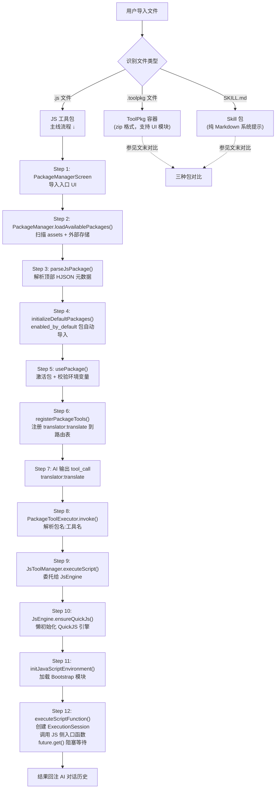

# Walkthrough: Skill 包（JS 工具包）从安装到被 AI 调用

> **场景：** 用户在包管理页面导入一个 JavaScript 工具包（`translator.js`），其中包含一个 `translate` 翻译工具。AI 在对话中输出 `<tool_call name="translator:translate">`，QuickJS 引擎执行 JS 脚本并将翻译结果回注给 AI。
>
> **前置知识：** 建议先读 `tool-execution.md`，了解工具调用在整个对话链路中的位置。
>
> **预计时间：** 30-40 分钟。

---

## 全链路总览



---

## 阶段一：导入 — JS 文件进入系统

### Step 1: 包管理 UI

```
📂 ui/features/packages/screens/PackageManagerScreen.kt
```

用户在包管理页面点击"导入"，选择本地 `.js` 文件。`PackageManagerScreen` 是所有包类型（JS 包、ToolPkg、Skill 包）的统一入口 UI，负责展示已导入包列表和触发导入流程。

---

### Step 2: 扫描可用包

```
📂 core/tools/packTool/PackageManager.kt L1107
```

```kotlin
private fun loadAvailablePackages(refreshExternalOnly: Boolean = false) {
    // L1117-1120: 扫描内置资源包（assets/packages/*.js）
    val assetSnapshot = scanAssetPackages()

    // L1123: 扫描外部存储目录的 .js / .toolpkg 文件，合并快照
    val mergedSnapshot = scanExternalPackages(assetSnapshot)

    applyPackageScanSnapshot(mergedSnapshot)
}
```

两条扫描路径：

- `scanAssetPackages()`（L823）：扫描 `assets/packages/` 目录，这是内置包的位置。
- `scanExternalPackages()`（L838）：扫描外部存储目录，用户手动导入的 `.js` 文件在这里被发现。

两条路径都会调用 `parseJsPackage()` 把文件内容解析成 `ToolPackage` 对象。

---

### Step 3: 解析 JS 文件元数据

```
📂 core/tools/packTool/PackageManager.kt L1413
```

JS 工具包的核心设计：**元数据写在 JS 文件顶部的块注释里，格式是 HJSON（宽松 JSON）**。

一个典型的 `translator.js` 文件头部长这样：

```javascript
/**
 * name: "translator"
 * description: { en: "Translation toolkit", zh: "翻译工具包" }
 * enabledByDefault: false
 * tools: [
 *   {
 *     name: "translate"
 *     description: { en: "Translate text", zh: "翻译文本" }
 *     parameters: [
 *       { name: "text", type: "string", required: true }
 *       { name: "target_lang", type: "string", required: false }
 *     ]
 *   }
 * ]
 */

async function translate(params) {
    const { text, target_lang = "zh" } = params;
    // 实际翻译逻辑...
    return { translated: result };
}
```

`parseJsPackage()` 的解析流程：

```kotlin
// L1419: 提取顶部块注释内容
val metadataString = extractMetadataFromJs(jsContent)

// L1422: 用 org.hjson.JsonValue 解析宽松 JSON
val metadataJson = org.json.JSONObject(
    JsonValue.readHjson(metadataString).toString()
)

// L1459-1460: 反序列化为 Kotlin 数据类
val jsonConfig = Json { ignoreUnknownKeys = true }
val packageMetadata = jsonConfig.decodeFromString<ToolPackage>(jsonString)

// L1471: 关键：每个 PackageTool 的 script 字段被设为【整个 JS 文件内容】
val tools = packageMetadata.tools.map { tool ->
    tool.copy(script = jsContent)   // 不是单个函数，是完整文件
}
```

> **设计要点：** `PackageTool.script` 存的是整个 `.js` 文件，而不是单个函数体。执行时 QuickJS 会加载完整文件，再按函数名调用目标函数。这样 JS 文件内部可以自由共享工具函数、全局变量等。

解析结果得到 `ToolPackage` 数据类：

```
📂 core/tools/ToolPackage.kt L267-301
```

```kotlin
data class ToolPackage(
    val name: String,                   // "translator"
    val description: LocalizedText,
    val tools: List<PackageTool>,       // [PackageTool(name="translate", script=<全文>)]
    val states: List<ToolPackageState> = emptyList(),
    val env: List<EnvVar> = emptyList(), // 环境变量声明（如 API Key）
    val isBuiltIn: Boolean = false,
    val enabledByDefault: Boolean = false,
    val category: String = "Other"
)
```

---

## 阶段二：激活 — 让 AI 知道这个工具存在

### Step 4: 默认包自动导入

```
📂 core/tools/packTool/PackageManager.kt L1074
```

```kotlin
private fun initializeDefaultPackages() {
    availablePackages.values.forEach { toolPackage ->
        if (toolPackage.isBuiltIn &&
            toolPackage.enabledByDefault &&   // 只有 enabled_by_default: true 的包
            !disabledPackages.contains(toolPackage.name)
        ) {
            importedPackages.add(toolPackage.name)  // 自动加入已导入列表
        }
    }
}
```

`translator.js` 如果 `enabledByDefault: false`，则需要用户手动在 UI 中点击"启用"，或者 AI 在对话中调用 `use_package("translator")` 来激活。

---

### Step 5: 激活包并校验环境变量

```
📂 core/tools/packTool/PackageManager.kt L2026
```

```kotlin
fun usePackage(packageName: String): String {
    // L2043: 检查是否在已导入列表中
    if (importedPackages.contains(normalizedPackageName)) {

        // L2045-2046: 加载包完整数据
        val toolPackage = getPackageTools(normalizedPackageName)
            ?: return "Failed to load package data for: $normalizedPackageName"

        // L2050-2076: 校验 env 声明的环境变量
        // 如果包声明了 required 环境变量（如 TRANSLATE_API_KEY）但用户没有配置，
        // 这里会返回错误提示，要求用户先设置 env var
        toolPackage.env.forEach { envVar ->
            val value = envPreferences.getEnv(envVar.name)
            if (envVar.required && value.isNullOrBlank()) {
                missingRequiredEnv.add(envVar.name)
            }
        }

        // 通过校验后，选择合适的状态（State）并注册工具
        val selectedPackage = selectToolPackageState(toolPackage)   // L2121
        registerPackageTools(selectedPackage)                        // L2230
    }
}
```

`selectToolPackageState()`（L2121）：包可以声明多个 `states`，每个 state 有一个条件表达式（如 `"hasRoot"`）。激活时根据当前设备能力选择最合适的 state，不同 state 可以提供不同的工具集合。

---

### Step 6: 注册工具到路由表

```
📂 core/tools/packTool/PackageManager.kt L2230
```

```kotlin
private fun registerPackageTools(toolPackage: ToolPackage) {
    // L2231: 创建执行器，持有 toolPackage 引用
    val packageToolExecutor = PackageToolExecutor(toolPackage, context, this)

    // L2232: advice 类型的"工具"只是提示信息，不可执行
    val executableTools = toolPackage.tools.filter { !it.advice }

    // L2241-2246: 注册每个工具，名称格式：packageName:toolName
    executableTools.forEach { packageTool ->
        val toolName = "${toolPackage.name}:${packageTool.name}"  // "translator:translate"
        aiToolHandler.registerTool(toolName) { tool ->
            packageToolExecutor.invoke(tool)
        }
    }
}
```

注册完成后，`translator:translate` 作为键存入 `AIToolHandler` 的路由表。下一次对话时，AI 的 System Prompt 中会出现这个工具的 Schema 描述，AI 就知道可以调用它了。

---

## 阶段三：调用 — AI 触发 JS 执行

### Step 7: AI 输出工具调用

AI 在对话中决定翻译一段文字，输出：

```xml
<tool_call name="translator:translate">
  <text>Hello World</text>
  <target_lang>zh</target_lang>
</tool_call>
```

这个 XML 被 `EnhancedAIService` 的 `extractToolInvocations()` 解析，然后进入工具执行管线（见 `tool-execution.md` Step 2-4 的通用流程）。

---

### Step 8: PackageToolExecutor 路由

```
📂 core/tools/ToolPackage.kt L338
```

`AIToolHandler` 找到 `"translator:translate"` 对应的执行器后，调用 `PackageToolExecutor.invoke()`：

```kotlin
override fun invoke(tool: AITool): ToolResult {
    // L348-356: 解析 packageName:toolName 格式
    val parts = tool.name.split(":")
    val packageName = parts[0]   // "translator"
    val toolName = parts[1]      // "translate"

    // L372-378: 在 toolPackage.tools 中查找目标工具
    val packageTool = toolPackage.tools.find { it.name == toolName }
        ?: return ToolResult(error = "Tool '$toolName' not found in package")

    // L382-383: 委托给 JsToolManager 执行，runBlocking 等待结果
    return runBlocking {
        jsToolManager.executeScript(packageTool.script, tool).last()
    }
}
```

此处 `packageTool.script` 就是 Step 3 中存入的整个 `translator.js` 文件内容。

---

### Step 9: JsToolManager 委托 JsEngine

```
📂 core/tools/javascript/JsEngine.kt
```

`JsToolManager.executeScript()` 最终调用 `JsEngine.executeScriptFunction()`，传入：
- `script`：完整 JS 文件内容
- `functionName`：`"translate"`（工具名）
- `params`：`{"text": "Hello World", "target_lang": "zh"}`

---

### Step 10: 懒初始化 QuickJS 引擎

```
📂 core/tools/javascript/JsEngine.kt L135
```

```kotlin
private fun ensureQuickJs() {
    if (quickJs != null) return  // 已初始化则直接返回
    synchronized(quickJsInitLock) {
        if (quickJs != null) return
        // L144-148: 在专用单线程 Executor 上创建 QuickJS 引擎实例
        val engine = runOnQuickJsThreadBlocking {
            OperitQuickJsEngine().also {
                it.bindNativeInterface(toolCallInterface)  // 绑定 JS↔Android 原生桥
            }
        }
        quickJs = engine
    }
}
```

QuickJS 引擎运行在专用单线程（线程名 `"OperitQuickJsEngine"`）上，所有 JS 操作都在这个线程串行执行，避免并发问题。

---

### Step 11: 加载 Bootstrap 模块

```
📂 core/tools/javascript/JsEngine.kt L543
📂 core/tools/javascript/JsLibraries.kt L11
```

```kotlin
private fun initJavaScriptEnvironment() {
    if (jsEnvironmentInitialized) return
    // 按顺序加载所有 Bootstrap 模块
    runtimeBootstrapModules().forEach(::evaluateBootstrapModule)
    jsEnvironmentInitialized = true
}
```

Bootstrap 模块加载顺序（每个模块只加载一次，后续复用）：

| 模块文件 | 提供的全局变量 | 用途 |
|---------|--------------|------|
| `execution-runtime.js` | — | 执行运行时桥，管理 ExecutionSession |
| `toolpkg-bridge.js` | `ToolPkg` | ToolPkg 注册桥 |
| `tools.js` | `Tools` | JS 侧工具调用 API（让 JS 可以调用 Operit 内置工具） |
| `compose-dsl-bridge.js` | `OperitComposeDslRuntime` | Compose UI DSL 桥 |
| `java-bridge.js` | `Java`, `Kotlin` | Java 类反射访问桥 |
| `third-party-libs.js` | `_`, `dataUtils` | Lodash 等第三方库 |
| `CryptoJS.js` | `CryptoJS` | 加密库 |
| `Jimp.js` | `Jimp` | 图像处理库 |

加载完这些模块后，JS 代码就能使用完整的 Operit JS API 环境了。

---

### Step 12: 执行脚本函数并等待结果

```
📂 core/tools/javascript/JsEngine.kt L571
```

```kotlin
internal fun executeScriptFunction(
    script: String,
    functionName: String,
    params: Map<String, Any?>,
    ...
): Any? {
    ensureQuickJs()
    if (!jsEnvironmentInitialized) {
        initJavaScriptEnvironment()
    }

    // L630-641: 创建 ExecutionSession，持有 CompletableFuture
    val callId = nextExecutionCallId()
    val session = createExecutionSession(callId, script, functionName, params, ...)
    activeExecutionSessions[callId] = session

    // L665-681: 在 QuickJS 线程上调用 JS 侧入口函数
    // JS 侧的 __operit_execute_package_function__ 负责：
    //   1. 动态 eval 用户脚本
    //   2. 调用其中的 functionName
    //   3. 将结果通过 native 回调返回
    launchQuickJsFunctionCall(
        functionName = TOOLPKG_EXECUTION_ENTRY_FUNCTION,  // "__operit_execute_package_function__"
        argsJson = executionArgsJson   // [callId, params, script, functionName, timeoutSec, ...]
    )

    // L700: 阻塞等待 JS 执行完毕（最长 timeoutSec 秒）
    val result = session.future.get(safeTimeoutSec, TimeUnit.SECONDS)
    return result
}
```

JS 执行完 `translate(params)` 后，通过 `toolCallInterface`（原生桥）把返回值写入 `session.future`，`future.get()` 解除阻塞，结果返回到 Kotlin 侧，被包装成 `ToolResult` 回注 AI 对话历史。

---

## 完整调用链回顾

```
用户导入 translator.js
  → PackageManager.loadAvailablePackages()                  [L1107]
    → scanExternalPackages() → parseJsPackage()             [L838 / L1413]
      → 提取 HJSON 元数据 + tool.copy(script = jsContent)   [L1471]
  → initializeDefaultPackages()（enabledByDefault 包自动导入）[L1074]

AI 对话中激活包
  → PackageManager.usePackage("translator")                 [L2026]
    → selectToolPackageState() → registerPackageTools()     [L2121 / L2230]
      → aiToolHandler.registerTool("translator:translate")  [L2243]

AI 输出 <tool_call name="translator:translate">
  → AIToolHandler 路由 → PackageToolExecutor.invoke()       [L346]
    → JsToolManager.executeScript(packageTool.script, tool)
      → JsEngine.executeScriptFunction()                    [L571]
        → ensureQuickJs() + initJavaScriptEnvironment()     [L135 / L543]
        → launchQuickJsFunctionCall("__operit_execute_package_function__")
        → session.future.get() 阻塞等待
        → JS 执行 translate(params) → 回调写入 future
      → 返回 ToolResult → 回注 AI 对话历史
```

---

## 涉及文件

| 文件路径 | 职责 |
|---------|------|
| `ui/features/packages/screens/PackageManagerScreen.kt` | 包管理 UI，导入入口 |
| `core/tools/packTool/PackageManager.kt` | 扫描、解析、激活、注册全流程 |
| `core/tools/ToolPackage.kt` | `ToolPackage` / `PackageTool` / `PackageToolExecutor` 数据模型与执行器 |
| `core/tools/javascript/JsEngine.kt` | QuickJS 引擎封装，Bootstrap 加载，脚本执行 |
| `core/tools/javascript/JsLibraries.kt` | Bootstrap 模块列表构建 |
| `core/tools/defaultTool/ToolRegistration.kt` | 系统内置工具注册（与包工具并列在 AIToolHandler 中） |
| `core/tools/skill/SkillManager.kt` | Skill 包管理（纯 Markdown，不执行代码） |
| `data/skill/SkillRepository.kt` | Skill 市场，从 GitHub 仓库导入 Skill 包 |

---

## 三种"包"的区别

项目中有三种不同性质的"包"，它们的区别经常让初次阅读代码的人感到困惑：

| 特性 | JS 工具包（.js） | ToolPkg 容器（.toolpkg） | Skill 包（SKILL.md） |
|-----|----------------|------------------------|---------------------|
| **文件格式** | 单个 `.js` 文件，顶部 HJSON 块注释 | ZIP 压缩包，含多个模块文件 | 单个 Markdown 文件 |
| **是否执行代码** | 是，QuickJS 执行 JS | 是，含主注册脚本 + 子模块 | 否 |
| **AI 感知方式** | 工具 Schema 注入 System Prompt | 工具 Schema 注入 System Prompt | 全文注入 AI 上下文（增强提示） |
| **支持 UI** | 否 | 是（`OperitComposeDslRuntime`） | 否 |
| **管理类** | `PackageManager` | `PackageManager`（toolPkg 分支） | `SkillManager` |
| **典型用途** | 翻译、搜索、API 封装 | 复杂工具集，带 UI 界面 | 为 AI 注入领域知识、角色设定 |

> Skill 包（`SKILL.md`）不会注册任何工具，它的内容会被 `SkillManager` 读取后直接注入 AI 的 System Prompt，让 AI 获得特定领域的背景知识或行为规范。

---

## 动手练习

### 练习 1: 观察 HJSON 解析

在 `PackageManager.kt:1422`（`JsonValue.readHjson()`）加断点。导入一个 `.js` 包，观察 `metadataString` 的原始内容和解析后的 `metadataJson` 结构。

### 练习 2: 追踪工具注册

在 `PackageManager.kt:2243`（`aiToolHandler.registerTool(toolName)`）加日志，打印 `toolName`。启动并激活一个 JS 包，检查 logcat 确认注册的工具全名（格式：`packageName:toolName`）。

### 练习 3: 观察 JS 执行过程

在 `JsEngine.kt:700`（`session.future.get()`）前后加日志，记录调用前时间戳和返回结果类型。让 AI 调用一个 JS 工具，观察 JS 侧执行耗时。

### 练习 4: 编写一个最小 JS 工具包

创建 `my_tool.js`：

```javascript
/**
 * name: "my_tool"
 * description: { en: "My first tool package", zh: "我的第一个工具包" }
 * tools: [
 *   {
 *     name: "greet"
 *     description: { en: "Say hello", zh: "打招呼" }
 *     parameters: [
 *       { name: "name", type: "string", required: true, description: { en: "Name", zh: "姓名" } }
 *     ]
 *   }
 * ]
 */

async function greet(params) {
    return { message: `Hello, ${params.name}!` };
}
```

将文件导入 Operit，在对话中让 AI 调用 `my_tool:greet`，观察完整执行链路。

---

## 关联文档

| 文档 | 关系 |
|------|------|
| `tool-execution.md` | 工具调用通用管线（Step 7 之后的权限检查、并行执行等） |
| `chat-message-flow.md` | 工具调用在完整对话链路中的位置 |
| `mcp-plugin-lifecycle.md` | MCP 插件的类似生命周期（对比学习） |
