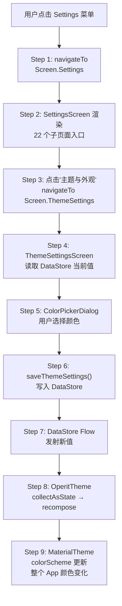

# Walkthrough: Settings 修改主题色

> **场景：** 用户打开 Settings → 点击"主题与外观" → 选择一个自定义主色调。从点击到整个 App 的颜色变化，经过了哪些代码。
>
> **覆盖知识：** 自定义导航栈、Settings 页面路由、DataStore 偏好读写、Compose 主题系统。
>
> **预计时间：** 20-30 分钟。

---

## 全链路总览



---

## Step 1: 自定义导航 — 不用 Jetpack Navigation

```
📂 ui/main/OperitApp.kt L71-75
```

```kotlin
var selectedItem by remember { mutableStateOf(initialNavItem) }
var currentScreen by remember {
    mutableStateOf(OperitRouter.getScreenForNavItem(initialNavItem))
}
val backStack = remember { mutableStateListOf<Screen>() }
```

Operit 不用 Jetpack Navigation。它用一个 `SnapshotStateList<Screen>` 作为自定义导航栈。

**导航操作就是列表操作：**
- `navigateTo(screen)` → 当前页压栈，切换到新页面
- `goBack()` → 弹栈，回到上一个页面；栈空则回到 AiChat

**为什么不用 Jetpack Navigation？** Operit 有 30+ 个页面（包括 22 个 Settings 子页面），深层嵌套的导航关系用 Jetpack Navigation 的 route 字符串管理容易出错。自定义导航栈用 sealed class 保证类型安全，IDE 直接跳转到页面定义。

```
📂 ui/main/screens/OperitScreens.kt
```

所有页面都是 `Screen` sealed class 的子类：

```kotlin
// L918-933
data object ThemeSettings :
    Screen(
        parentScreen = Settings,         // 父页面
        navItem = NavItem.Settings,      // 导航栏选中项
        titleRes = R.string.screen_title_theme_settings
    ) {
    @Composable
    override fun Content(...) {
        ThemeSettingsScreen()             // 渲染这个 Composable
    }
}
```

每个 `Screen` 子类声明了：
- `parentScreen` — 按返回键回到哪里
- `navItem` — 底部导航栏哪个 Tab 高亮
- `Content()` — 渲染什么 Composable

用户点击侧边栏的 Settings 图标时，`selectedItem = NavItem.Settings` → `currentScreen = Screen.Settings`。

> **→ 下一步：Settings 主页面渲染。`SettingsScreen.kt`**

---

## Step 2: SettingsScreen — 22 个子页面的入口

```
📂 ui/features/settings/screens/SettingsScreen.kt L48
```

```kotlin
@Composable
fun SettingsScreen(
    navigateToThemeSettings: () -> Unit,    // 点击"主题"跳到 ThemeSettings
    navigateToModelConfig: () -> Unit,       // 点击"模型配置"跳到 ModelConfig
    navigateToLanguage: () -> Unit,          // ...
    // ... 22 个导航回调
)
```

**每个子页面入口对应一个 `navigateTo` 回调。** 这些回调在 `Screen.Settings.Content()` 中绑定：

```
📂 ui/main/screens/OperitScreens.kt L459-479
```

```kotlin
// Screen.Settings 的 Content 实现
SettingsScreen(
    navigateToThemeSettings = { navigateTo(ThemeSettings) },
    navigateToModelConfig = { navigateTo(ModelConfig) },
    navigateToLanguage = { navigateTo(Language) },
    // ...
)
```

Settings 主页面就是一个设置项列表。每个设置项的 `onClick` 调用对应的 `navigateTo` 回调。

### "主题与外观"列表项（L162-167）

```kotlin
SettingsListItem(
    title = stringResource(R.string.theme_settings),
    icon = Icons.Outlined.Palette,
    onClick = navigateToThemeSettings    // → navigateTo(ThemeSettings)
)
```

用户点击 → `navigateTo(Screen.ThemeSettings)` → `currentScreen = Screen.ThemeSettings` → Compose 重组 → 渲染 `ThemeSettingsScreen()`。

> **→ 下一步：ThemeSettingsScreen 渲染。`ThemeSettingsScreen.kt` L165**

---

## Step 3-4: ThemeSettingsScreen — 读取当前主题配置

```
📂 ui/features/settings/screens/ThemeSettingsScreen.kt L165
```

```kotlin
@Composable
fun ThemeSettingsScreen() {
    val context = LocalContext.current
    val preferencesManager = remember { UserPreferencesManager.getInstance(context) }

    // L199-203: 从 DataStore 收集当前主题配置
    val customPrimaryColor = preferencesManager.customPrimaryColor
        .collectAsState(initial = null).value
    val customSecondaryColor = preferencesManager.customSecondaryColor
        .collectAsState(initial = null).value
    val useCustomColors = preferencesManager.useCustomColors
        .collectAsState(initial = false).value
    // ... 60+ 个偏好 Flow
}
```

**`collectAsState`** 把 DataStore 的 Flow 转成 Compose State。当 DataStore 的值变化时，State 自动更新，触发 UI 重组。

**注意：** ThemeSettingsScreen 直接读 DataStore，**没有 ViewModel**。Operit 的大部分 Settings 页面都是这样——DataStore Flow → `collectAsState` → UI。因为 Settings 页面的数据模型就是 DataStore 本身，不需要额外的状态转换层。

> **→ 下一步：用户点击颜色选择器**

---

## Step 5: 用户选择颜色 — ColorPickerDialog

```
📂 ui/features/settings/screens/ThemeSettingsScreen.kt L1954-1973
```

当用户点击"自定义主色调"按钮时，`showColorPicker = true` → 弹出 `ColorPickerDialog`：

```kotlin
if (showColorPicker) {
    ColorPickerDialog(
        initialColor = currentPrimaryColor,
        onColorSelected = { selectedColor ->
            handleThemeColorSelected("primary", selectedColor)
        },
        onDismiss = { showColorPicker = false }
    )
}
```

用户在颜色选择器里滑动选中一个颜色，点确认。

> **→ 下一步：写入 DataStore**

---

## Step 6: 写入 DataStore — 颜色持久化

```
📂 ui/features/settings/screens/ThemeSettingsScreen.kt L1703-1750
```

```kotlin
private fun handleThemeColorSelected(colorType: String, color: Color) {
    scope.launch {
        when (colorType) {
            "primary" -> preferencesManager.saveThemeSettings(
                customPrimaryColor = color.toArgb()
            )
            "secondary" -> preferencesManager.saveThemeSettings(
                customSecondaryColor = color.toArgb()
            )
        }
    }
}
```

跟进 `saveThemeSettings`：

```
📂 data/preferences/UserPreferencesManager.kt L1023-1130
```

```kotlin
suspend fun saveThemeSettings(
    customPrimaryColor: Int? = null,
    customSecondaryColor: Int? = null,
    // ... 很多可选参数
) {
    context.userPreferencesDataStore.edit { preferences ->
        customPrimaryColor?.let {
            preferences[CUSTOM_PRIMARY_COLOR] = it   // intPreferencesKey
        }
        customSecondaryColor?.let {
            preferences[CUSTOM_SECONDARY_COLOR] = it
        }
        // ...
    }
}
```

**DataStore key 定义（L78-82）：**

```kotlin
private val CUSTOM_PRIMARY_COLOR = intPreferencesKey("custom_primary_color")
private val CUSTOM_SECONDARY_COLOR = intPreferencesKey("custom_secondary_color")
private val USE_CUSTOM_COLORS = booleanPreferencesKey("use_custom_colors")
```

`context.userPreferencesDataStore.edit { ... }` 是一个事务性写入——修改 DataStore 的 Preferences 对象，然后自动持久化到磁盘。

> **→ 下一步：DataStore Flow 发射新值**

---

## Step 7: DataStore Flow 发射新值

```
📂 data/preferences/UserPreferencesManager.kt L370-373
```

```kotlin
val customPrimaryColor: Flow<Int?> =
    context.userPreferencesDataStore.data.map { preferences ->
        preferences[CUSTOM_PRIMARY_COLOR]
    }
```

**DataStore 的 `data` 属性是一个 Flow。** 当 Step 6 的 `edit` 完成后，`data` Flow 会自动发射新值。所有通过 `collectAsState` 订阅这个 Flow 的 Composable 都会收到更新。

关键的是：不只是 `ThemeSettingsScreen` 在监听这个 Flow，**`OperitTheme` 也在监听**。

> **→ 下一步：OperitTheme 重组**

---

## Step 8: OperitTheme 重组 — 颜色方案重算

```
📂 ui/theme/Theme.kt L90
```

```kotlin
@Composable
fun OperitTheme(content: @Composable () -> Unit) {
    val preferencesManager = remember {
        UserPreferencesManager.getInstance(LocalContext.current)
    }

    // L101-104: 从 DataStore 收集主题设置
    val useCustomColors by preferencesManager.useCustomColors
        .collectAsState(initial = false)
    val customPrimaryColor by preferencesManager.customPrimaryColor
        .collectAsState(initial = null)
    val customSecondaryColor by preferencesManager.customSecondaryColor
        .collectAsState(initial = null)

    // ... 其他主题设置（暗色模式、圆角、字体等）

    // L179-190: 如果启用了自定义颜色，生成新的配色方案
    if (useCustomColors) {
        customPrimaryColor?.let { primaryArgb ->
            val primary = Color(primaryArgb)
            val secondary = customSecondaryColor?.let { Color(it) }
                ?: colorScheme.secondary

            colorScheme = if (darkTheme) {
                generateDarkColorScheme(primary, secondary, onColorMode)
            } else {
                generateLightColorScheme(primary, secondary, onColorMode)
            }
        }
    }

    // L514-518: 应用配色方案
    MaterialTheme(
        colorScheme = colorScheme,
        typography = typography,
        content = content
    )
}
```

**当 `customPrimaryColor` 的值变化时：**

1. `collectAsState` 检测到 Flow 发射了新值
2. `customPrimaryColor` State 更新
3. `OperitTheme` 被标记为需要重组
4. 重组时走到 `if (useCustomColors)` 分支
5. 用新颜色调用 `generateDarkColorScheme` / `generateLightColorScheme`
6. 生成新的 `ColorScheme` 对象
7. 传给 `MaterialTheme`

> **→ 下一步：颜色传播到整个 App**

---

## Step 9: 颜色传播 — 整个 App 立即变色

```
📂 ui/theme/Theme.kt L524-603
```

`generateLightColorScheme` / `generateDarkColorScheme` 从两个自定义颜色（primary + secondary）生成完整的 Material 3 配色方案：

```kotlin
private fun generateDarkColorScheme(
    primary: Color,
    secondary: Color,
    onColorMode: String
): ColorScheme {
    return darkColorScheme(
        primary = primary,
        onPrimary = calculateOnColor(primary, onColorMode),
        primaryContainer = primary.copy(alpha = 0.3f),
        secondary = secondary,
        onSecondary = calculateOnColor(secondary, onColorMode),
        surface = Color(0xFF121212),
        background = Color(0xFF121212),
        // ... 完整的 Material 3 配色
    )
}
```

**`MaterialTheme` 的 `colorScheme` 变化后：**

- 所有使用 `MaterialTheme.colorScheme.primary` 的 Composable 自动获取新颜色
- 按钮、AppBar、FAB、Switch、TextField 等 Material 组件全部更新
- 不需要手动通知任何组件——Compose 的响应式机制自动处理

**完整的数据流：**
```
用户选颜色 → saveThemeSettings() → DataStore.edit()
  → DataStore.data Flow 发射新值
    → OperitTheme.collectAsState() 收到新值
      → OperitTheme 重组 → generateDarkColorScheme()
        → MaterialTheme(colorScheme = 新配色)
          → 所有子 Composable 重组 → UI 颜色更新
```

**整个过程是即时的**——用户选完颜色的瞬间，整个 App 就变色了。不需要重启 Activity。

---

## 完整调用链回顾

```
用户点击 Settings → 主题与外观
│
├─ Step 1:  navigateTo(Screen.Settings)              [OperitApp.kt L71]
│           自定义导航栈，Screen sealed class
│
├─ Step 2:  SettingsScreen 渲染                       [SettingsScreen.kt L48]
│           22 个子页面入口
│
├─ Step 3:  点击"主题与外观"                           [SettingsScreen.kt L162]
│           onClick → navigateTo(Screen.ThemeSettings)
│
├─ Step 4:  ThemeSettingsScreen 渲染                   [ThemeSettingsScreen.kt L165]
│           collectAsState 读取 DataStore 当前值
│
├─ Step 5:  ColorPickerDialog 弹出                    [ThemeSettingsScreen.kt L1954]
│           用户选择颜色
│
├─ Step 6:  saveThemeSettings() 写入 DataStore          [UserPreferencesManager.kt L1023]
│           userPreferencesDataStore.edit { ... }
│
├─ Step 7:  DataStore Flow 发射新值                    [UserPreferencesManager.kt L370]
│           customPrimaryColor Flow → 新值
│
├─ Step 8:  OperitTheme collectAsState 触发重组         [Theme.kt L101]
│           generateDarkColorScheme(newPrimary, ...)
│
└─ Step 9:  MaterialTheme 更新 → 整个 App 变色         [Theme.kt L514]

涉及文件（按调用顺序）:
1. ui/main/OperitApp.kt                    — 导航栈管理
2. ui/main/screens/OperitScreens.kt        — Screen 定义 + 路由
3. ui/features/settings/screens/SettingsScreen.kt — Settings 主页面
4. ui/features/settings/screens/ThemeSettingsScreen.kt — 主题设置页面
5. data/preferences/UserPreferencesManager.kt — DataStore 读写
6. ui/theme/Theme.kt                        — OperitTheme + 配色生成
```

---

## 核心模式：DataStore → Flow → collectAsState → UI

这个模式贯穿 Operit 的整个 Settings 系统。理解了主题色的链路，其他 Settings 页面（语言、模型配置、布局设置等）都是同样的模式：

```
页面 collectAsState(preferencesManager.xxxFlow) → 显示当前值
  → 用户修改 → preferencesManager.saveXxx() → DataStore.edit()
    → Flow 发射新值 → collectAsState 更新 → UI 重组
```

**28 个 DataStore 偏好文件**都遵循这个模式。没有 ViewModel 中间层，Settings 页面直接操作 DataStore。

---

## 动手练习

### 练习 1: 追踪颜色变化

在 `Theme.kt:179`（`if (useCustomColors)` 分支）加断点。打开 Settings → 主题 → 修改主色调。观察：
- `customPrimaryColor` 的值（ARGB 整数）
- `colorScheme` 更新前后的 `primary` 颜色对比

### 练习 2: 理解导航栈

在 `OperitApp.kt` 的 `navigateTo` 函数加日志，打印 `backStack` 内容。从主界面 → Settings → ThemeSettings → 返回 → 返回，观察栈的变化。

### 练习 3: 找到其他 Settings 页面的相同模式

打开 `SettingsScreen.kt`，找到"语言设置"的 onClick 回调。跟踪到 `LanguageSettingsScreen`，验证它是否也是 `DataStore Flow → collectAsState → UI` 的模式。

---

## 关联文档

| 文档 | 关系 |
|------|------|
| `chat-message-flow.md` | 核心业务链路 |
| `cold-start.md` | 启动链路 |
| `tool-execution.md` | 工具系统 |
| `mcp-plugin-lifecycle.md` | 下一篇导读 |
