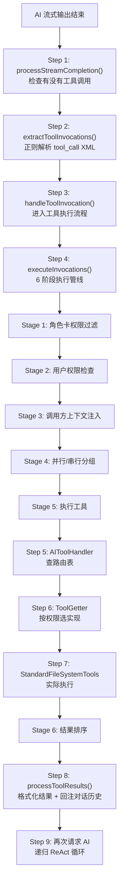

# Walkthrough: AI 调用一个工具的完整过程

> **场景：** AI 决定调用 `list_files` 工具查看 `/sdcard` 目录。从 AI 输出 XML 标签到工具执行完毕、结果回注给 AI，经过了哪些代码。
>
> **前置知识：** 建议先读 `chat-message-flow.md` 的 Step 11-14，了解工具调用在整个对话链路中的位置。
>
> **预计时间：** 30-40 分钟。

---

## 全链路总览



---

## 前置：工具 Schema — AI 怎么知道有 list_files 这个工具

在跟代码之前，先理解一个前提：AI 不是天生知道有哪些工具的。它需要在 System Prompt 里看到每个工具的"说明书"（Schema）。

```
📂 core/config/SystemToolPrompts.kt L92
```

```kotlin
ToolPrompt(
    name = "list_files",
    description = "List files in a directory.",
    parametersStructured = listOf(
        ToolParameterSchema(
            name = "path",
            type = "string",
            description = "e.g. \"/sdcard/Download\"",
            required = true
        ),
        ToolParameterSchema(
            name = "environment",
            type = "string",
            description = "optional, same as read_file environment",
            required = false
        )
    )
)
```

这个 Schema 在 Step 8（System Prompt 注入，见 W1 文档）被转换成文本注入到 System Prompt 里。AI 看到后知道：有个叫 `list_files` 的工具，需要 `path` 参数，可以列出目录内容。

---

## Step 1: 流结束 — 检查有没有工具调用

```
📂 api/chat/EnhancedAIService.kt L1491-1614
```

AI 的流式输出结束了。`processStreamCompletion` 读取完整输出：

```kotlin
// L1520: 读取累积的完整输出
val content = context.streamBuffer.toString().trim()
```

假设 AI 输出了：
```
我来帮你查看 /sdcard 目录下的文件。

<tool_call name="list_files">
  <path>/sdcard</path>
</tool_call>
```

### 工具检测增强（L1589-1605）

```kotlin
val enhancedContent = enhanceToolDetection(content)
val (repairedContent, wasTruncated) = detectAndRepairTruncatedToolRound(enhancedContent)
```

两道保护：
1. `enhanceToolDetection` — 修复 AI 输出的常见格式错误（比如标签未闭合）
2. `detectAndRepairTruncatedToolRound` — 如果工具调用被 Token 限制截断了（比如只输出了 `<tool_call name="list_files"><path>/sdc`），尝试修复

### 提取工具调用（L1607-1614）

```kotlin
val extractedToolInvocations = ToolExecutionManager.extractToolInvocations(finalContent)
```

**→ 跳到 Step 2**

### 决策分支（L1694）

```kotlin
if (extractedToolInvocations.isNotEmpty()) {
    handleToolInvocation(extractedToolInvocations, context, ...)
}
```

有工具调用 → 进入 `handleToolInvocation`（Step 3）。

> **→ 下一步：跳到 `ToolExecutionManager.extractToolInvocations`，`api/chat/enhance/ToolExecutionManager.kt` L156**

---

## Step 2: XML 解析 — 从文本中提取工具调用

```
📂 api/chat/enhance/ToolExecutionManager.kt L156-200
```

```kotlin
suspend fun extractToolInvocations(response: String): List<ToolInvocation> {
    val invocations = mutableListOf<ToolInvocation>()

    // L163: 流式 XML 解析
    charStream.splitBy(plugins).collect { chunk ->
        if (chunk.group.tag != StreamXmlPlugin::class) return@collect  // 只看 XML 块

        // L171: 正则匹配 <tool_call name="...">...</tool_call>
        ChatMarkupRegex.toolCallPattern.findAll(chunkString).forEach { match ->
            val toolName = match.groupValues[2]   // "list_files"
            val toolBody = match.groupValues[3]   // "<path>/sdcard</path>"

            // L176: 提取参数
            val params = MessageContentParser.toolParamPattern.findAll(toolBody).map { paramMatch ->
                val paramName = paramMatch.groupValues[1]    // "path"
                val paramValue = unescapeXml(paramMatch.groupValues[2])  // "/sdcard"
                ToolParameter(name = paramName, value = paramValue)
            }.toList()

            // L184-190: 构建 ToolInvocation
            invocations.add(ToolInvocation(
                tool = AITool(name = toolName, parameters = params),
                rawText = match.value,
                responseLocation = ...
            ))
        }
    }
    return invocations
}
```

**工具调用是文本级的 XML 标签，不是函数调用。** 整个解析过程就是：正则匹配 `<tool_call>` → 提取工具名 → 正则匹配参数标签 → 提取参数名和值。

解析结果：
```
[ToolInvocation(
    tool = AITool(
        name = "list_files",
        parameters = [ToolParameter(name="path", value="/sdcard")]
    ),
    rawText = "<tool_call name=\"list_files\"><path>/sdcard</path></tool_call>"
)]
```

> **→ 下一步：回到 `handleToolInvocation`，它内部调用 `executeInvocations`。同文件 L331**

---

## Step 3: handleToolInvocation — 进入执行流程

```
📂 api/chat/EnhancedAIService.kt L1694+
```

`handleToolInvocation` 做了几件事：
1. 通知 UI 显示工具调用卡片（`onToolInvocation` 回调）
2. 调用 `ToolExecutionManager.executeInvocations()`
3. 收集执行结果
4. 调用 `processToolResults()` 把结果回注给 AI

核心就是 `executeInvocations`，我们直接跟进去。

> **→ 下一步：`ToolExecutionManager.executeInvocations`，`api/chat/enhance/ToolExecutionManager.kt` L331**

---

## Step 4: executeInvocations — 6 阶段执行管线

```
📂 api/chat/enhance/ToolExecutionManager.kt L331-475
```

整个方法在 `coroutineScope { }` 内执行，保证所有并行任务完成后才返回。

### Stage 1: 角色卡权限过滤（L359-380）

```kotlin
invocations.forEach { inv ->
    val access = roleCardToolAccess?.check(inv.tool.name)
    if (access == DENIED) {
        roleCardDeniedResults.add(buildRoleCardDeniedResult(inv))
        // 直接输出拒绝结果给 AI
        collector.emit(formatDeniedMessage(inv))
    }
}
```

角色卡作者可以限制 AI 不能调用某些工具。比如一个"安全助手"角色卡可能禁止 `shell_command` 和 `delete_file`。

**我们的场景：** `list_files` 是只读工具，通常不会被角色卡禁止。通过。

### Stage 2: 用户权限检查（L383-398）

```kotlin
toolHandler.notifyToolCallRequested(inv.tool.name)

val permission = checkToolPermission(inv.tool.name)
if (permission == FORBID) {
    permissionDeniedResults.add(ToolResult(
        toolName = inv.tool.name,
        error = "User cancelled the tool execution."
    ))
}
```

三层优先级检查：**角色卡 > 工具级覆盖 > 全局开关**。

如果全局开关设为 `ASK`，会弹窗询问用户"是否允许 AI 执行 list_files？"。

### Stage 3: 调用方上下文注入（L400-436）

```kotlin
if (callerName != null || callerChatId != null) {
    // 给 JS 包工具注入隐藏参数
    tool.parameters.add(ToolParameter("__operit_package_caller_name", callerName))
    tool.parameters.add(ToolParameter("__operit_package_chat_id", callerChatId))
}
```

这一步只对 JS 工具包脚本有影响。内置工具不受影响。

### Stage 4: 并行/串行分组（L439-448）

```kotlin
val parallelizableToolNames = setOf(
    "list_files", "read_file", "read_file_part", "read_file_full", "file_exists",
    "find_files", "file_info", "grep_code", "calculate", "ffmpeg_info",
    "visit_web", "download_file"
)

val (parallelInvocations, serialInvocations) = injectedInvocations.partition {
    parallelizableToolNames.contains(it.tool.name)
}
```

**12 个只读/无副作用的工具可以并行执行。** 其他所有工具（`shell_command`、`write_file`、`delete_file` 等有副作用的）串行执行。

`list_files` 在并行列表中。如果 AI 同时调用了 `list_files` 和 `read_file`，它们会并行执行。

### Stage 5: 执行（L450-468）

```kotlin
// 并行工具：每个启动一个 async 协程
val parallelJobs = parallelInvocations.map { inv ->
    async {
        val result = executeAndEmitTool(inv, context, toolHandler, packageManager, collector)
        aggregatedResults[inv] = result
    }
}

// 串行工具：按顺序执行
for (inv in serialInvocations) {
    val result = executeAndEmitTool(inv, context, toolHandler, packageManager, collector)
    aggregatedResults[inv] = result
}

// 等待所有并行任务完成
parallelJobs.awaitAll()
```

**`executeAndEmitTool` 内部调用了 `AIToolHandler` 查路由表 → Step 5。**

### Stage 6: 结果排序（L471-474）

```kotlin
val orderedResults = injectedInvocations.mapNotNull { aggregatedResults[it] }
return roleCardDeniedResults + permissionDeniedResults + orderedResults
```

无论并行还是串行，最终结果按**原始调用顺序**排列。

> **→ 下一步：`executeAndEmitTool` 内部查路由表。跳到 `AIToolHandler`**

---

## Step 5: 工具路由表 — 名字怎么映射到代码

```
📂 core/tools/AIToolHandler.kt L254
```

```kotlin
fun getToolExecutorOrActivate(toolName: String): ToolExecutor? {
    return availableTools[toolName]  // Map<String, ToolExecutor> 查找
}
```

`availableTools` 是一个 `Map<String, ToolExecutor>`，在启动时通过 `registerDefaultTools()` 填充。

### 工具注册（ToolRegistration.kt）

```
📂 core/tools/ToolRegistration.kt L30
```

```kotlin
fun registerAllTools(handler: AIToolHandler, context: Context) {
    val fileSystemTools = ToolGetter.getFileSystemTools(context)  // ← Step 6

    // ... 1000+ 行注册代码 ...
}
```

`list_files` 的注册在 **L1280-1291**：

```kotlin
handler.registerTool(
    name = "list_files",
    descriptionGenerator = { tool -> ... },
    executor = { tool ->
        runBlocking(Dispatchers.IO) {
            fileSystemTools.listFiles(tool)  // ← Step 7
        }
    }
)
```

**这就是路由表的本质：** `"list_files"` 字符串 → `fileSystemTools.listFiles(tool)` 方法调用。所有 40+ 个工具都是这样注册的，每个都是一个 `handler.registerTool(name, executor)` 调用。

**注意 `runBlocking(Dispatchers.IO)`：** 工具执行器本身不是 suspend 函数，但文件系统操作需要在 IO 线程执行。所以用 `runBlocking` 包了一层。

> **→ 下一步：`ToolGetter.getFileSystemTools` 按权限选择实现。跳到 `ToolGetter.kt` L20**

---

## Step 6: 权限路由 — 同一个工具名，不同权限下行为不同

```
📂 core/tools/defaultTool/ToolGetter.kt L20-34
```

```kotlin
fun getFileSystemTools(context: Context): StandardFileSystemTools {
    return when (androidPermissionPreferences.getPreferredPermissionLevel()) {
        AndroidPermissionLevel.ROOT          -> RootFileSystemTools(context)
        AndroidPermissionLevel.ADMIN         -> AdminFileSystemTools(context)
        AndroidPermissionLevel.DEBUGGER      -> DebuggerFileSystemTools(context)
        AndroidPermissionLevel.ACCESSIBILITY -> AccessibilityFileSystemTools(context)
        AndroidPermissionLevel.STANDARD      -> StandardFileSystemTools(context)
        null -> StandardFileSystemTools(context)
    }
}
```

**这是整个工具系统最优雅的设计。** 用户在启动时选择了权限级别（Standard/Admin/Root/...），之后 AI 调用工具时自动路由到对应实现，不需要改任何业务代码。

| 权限级别 | 实现类 | `listFiles` 的行为 |
|---------|--------|-------------------|
| Standard | `StandardFileSystemTools` | `File(path).listFiles()`，只能访问 App 可见目录 |
| Admin | `AdminFileSystemTools` | 通过 Shizuku ADB 级权限列出文件 |
| Root | `RootFileSystemTools` | Root Shell 执行 `ls`，可访问 `/system` 等 |

**继承关系：** `RootFileSystemTools extends AdminFileSystemTools extends StandardFileSystemTools`。子类只 override 需要改变的方法，其他方法继承 Standard 实现。

同样的模式在所有 17 个 getter 方法中重复（L20-207），覆盖了文件系统、Shell、UI 自动化、系统操作、设备信息等工具类别。

> **→ 下一步：`StandardFileSystemTools.listFiles` 实际执行。跳到 `standard/StandardFileSystemTools.kt` L1223**

---

## Step 7: 工具执行 — 真正干活的代码

```
📂 core/tools/defaultTool/standard/StandardFileSystemTools.kt L1223
```

```kotlin
open suspend fun listFiles(tool: AITool): ToolResult {
    // L1224-1225: 提取参数
    val path = tool.parameters.find { it.name == "path" }?.value ?: ""
    val environment = tool.parameters.find { it.name == "environment" }?.value

    // L1229: Linux 环境路由
    if (isLinuxEnvironment(environment)) return linuxTools.listFiles(tool)
    // L1232: SAF 环境路由
    if (isSafEnvironment(environment)) return safTools.listFiles(tool)

    // L1235: 安全校验（防路径穿越攻击）
    PathValidator.validateAndroidPath(path, tool.name)?.let { return it }

    // L1240: 检查目录存在性
    val directory = File(path)
    if (!directory.exists() || !directory.isDirectory) {
        return ToolResult(success = false, error = "Not a valid directory: $path")
    }

    // L1266: 列出文件
    val entries = directory.listFiles()?.map { file ->
        DirectoryListingData.FileEntry(
            name = file.name,
            isDirectory = file.isDirectory,
            size = file.length(),
            permissions = getFilePermissions(file),
            lastModified = dateFormat.format(Date(file.lastModified()))
        )
    } ?: emptyList()

    return ToolResult(
        toolName = tool.name,
        success = true,
        result = DirectoryListingData(path, entries)
    )
}
```

7 个关键步骤：
1. **参数提取** — 从 `AITool.parameters` 列表中找 `path` 和 `environment`
2. **环境路由** — `linux` 走 Linux 文件系统工具（chroot/proot 环境），`saf` 走 Android SAF（外部存储/SD 卡）
3. **安全校验** — `PathValidator` 防止 `../../etc/passwd` 之类的路径穿越攻击
4. **存在性检查** — 目录不存在返回错误
5. **列出文件** — `File(path).listFiles()` 标准 Java API
6. **构建结果** — 每个文件的名称、类型、大小、权限、修改时间
7. **返回 ToolResult** — `success = true` + `DirectoryListingData`

**注意 `open` 关键字：** 子类（Admin/Root）可以 override 这个方法，用更高权限的方式列出文件。

> **→ 下一步：工具执行完毕，结果回到 `executeInvocations`，然后回到 `processToolResults`。跳到 `EnhancedAIService.kt` L1971**

---

## Step 8: 结果回注 — 把工具结果告诉 AI

```
📂 api/chat/EnhancedAIService.kt L1971-2036
```

```kotlin
private suspend fun processToolResults(results: List<ToolResult>, context: MessageExecutionContext, ...) {
    // L1996-1998: 格式化工具结果
    val formattedResults = results.joinToString("\n") {
        ConversationMarkupManager.formatToolResultForMessage(it)
    }
    // 格式化后类似：
    // <tool_result name="list_files" success="true">
    //   Documents/  (dir)
    //   Downloads/  (dir)
    //   DCIM/       (dir)
    //   photo.jpg   (1.2MB, 2024-01-15)
    //   ...
    // </tool_result>

    // L2025-2031: 添加到对话历史
    context.conversationHistory.add(PromptTurn(
        kind = PromptTurnKind.TOOL_RESULT,
        content = formattedResults
    ))

    // L2033-2036: 规范化对话历史格式
    val normalized = conversationService.normalizeConversationHistoryForModel(context.conversationHistory)
    context.conversationHistory.clear()
    context.conversationHistory.addAll(normalized)
}
```

工具结果被格式化为 `<tool_result>` XML 标签，添加到对话历史中。此时对话历史变成：

```
[System]    你是 Operit AI 助手... （System Prompt）
[User]      帮我查看 /sdcard 下的文件
[Assistant] 我来帮你查看... <tool_call name="list_files"><path>/sdcard</path></tool_call>
[ToolResult] <tool_result name="list_files" success="true">Documents/ Downloads/ ...</tool_result>
```

> **→ 下一步：再次请求 AI**

---

## Step 9: 再次请求 AI — ReAct 循环

```
📂 api/chat/EnhancedAIService.kt L2112-2252
```

```kotlin
// L2112-2123: 用更新后的对话历史再次请求 AI
val responseStream = serviceForFunction.sendMessage(
    conversationHistory = context.conversationHistory,  // 包含工具结果
    ...
)

// L2142-2206: 再次流式收集（和 Step 10 一样的循环）
responseStream.collect { content ->
    context.streamBuffer.append(content)
    collector.emit(content)
}

// L2232-2252: 流结束后，递归检查
processStreamCompletion(context, ...)  // 回到 Step 1
```

AI 看到工具结果后，生成最终回复：

```
你的 /sdcard 目录下有以下文件和文件夹：
- Documents/（目录）
- Downloads/（目录）
- DCIM/（目录）
- photo.jpg（1.2MB）
...
```

**`processStreamCompletion` 递归调用** — 如果这次 AI 又输出了工具调用，继续执行；如果没有，循环结束。

**这就是 ReAct 循环的本质：**
```
sendMessage → 流式收集 → processStreamCompletion
  → 有工具调用？→ extractToolInvocations → executeInvocations → processToolResults
    → sendMessage → 流式收集 → processStreamCompletion
      → 有工具调用？→ ... (递归)
      → 没有 → 循环结束，最终回复渲染完毕
```

---

## 完整调用链回顾

```
AI 输出 "<tool_call name='list_files'><path>/sdcard</path></tool_call>"
│
├─ Step 1:  processStreamCompletion()              [L1491] 读取完整输出
├─ Step 2:  extractToolInvocations()               [L156]  正则解析 XML
├─ Step 3:  handleToolInvocation()                          进入执行流程
├─ Step 4:  executeInvocations()                   [L331]  6 阶段管线
│   ├─ Stage 1: 角色卡权限检查                               通过
│   ├─ Stage 2: 用户权限检查                                 通过
│   ├─ Stage 3: 上下文注入                                   跳过（非 JS 包）
│   ├─ Stage 4: 并行/串行分组                                list_files → 并行
│   ├─ Stage 5: 执行
│   │   ├─ Step 5: AIToolHandler 查路由表           [L254]  "list_files" → executor
│   │   ├─ Step 6: ToolGetter.getFileSystemTools()  [L20]   Standard/Admin/Root
│   │   └─ Step 7: StandardFileSystemTools.listFiles() [L1223] File.listFiles()
│   └─ Stage 6: 结果排序                                    按原始顺序
│
├─ Step 8:  processToolResults()                   [L1971] <tool_result> 回注
└─ Step 9:  再次请求 AI                             [L2112] 递归 ReAct 循环

涉及文件（按调用顺序）:
1. api/chat/EnhancedAIService.kt              — 流结束检测 + ReAct 驱动
2. api/chat/enhance/ToolExecutionManager.kt   — XML 解析 + 执行管线
3. core/tools/AIToolHandler.kt                — 路由表查找
4. core/tools/ToolRegistration.kt             — 工具注册
5. core/tools/defaultTool/ToolGetter.kt       — 权限级别路由
6. core/tools/defaultTool/standard/StandardFileSystemTools.kt — 工具实现
7. core/config/SystemToolPrompts.kt           — Schema 定义
```

---

## 动手练习

### 练习 1: 追踪工具调用

在 `ToolExecutionManager.kt:171` 加断点。对 AI 说"帮我列出 /sdcard/Download 下的文件"：
- 检查 `chunkString` — AI 的原始输出
- 检查 `toolName` 和 `params` — 解析结果

### 练习 2: 观察权限路由

在 `ToolGetter.kt:20` 的 `when` 表达式加断点：
- `getPreferredPermissionLevel()` 返回什么？
- 最终创建的是哪个子类实例？

在设置里切换权限级别，再次触发工具调用，观察变化。

### 练习 3: 并行 vs 串行

让 AI 同时调用多个工具（比如"帮我列出 /sdcard 和 /sdcard/Download 下的文件，然后读取 /sdcard/readme.txt 的内容"）。在 `ToolExecutionManager.kt:444` 加断点：
- `parallelInvocations` 有几个？
- `serialInvocations` 有几个？

### 练习 4: 新增一个工具

按以下步骤新增 `get_battery_level` 工具：
1. `SystemToolPrompts.kt` 添加 Schema
2. `StandardDeviceInfoToolExecutor.kt` 添加实现
3. `ToolRegistration.kt` 添加注册
4. 重新编译，对 AI 说"帮我看看电池还剩多少"

---

## 关联文档

| 文档 | 关系 |
|------|------|
| `44_Tutorial.工具系统精讲.md` | 概念层 — Schema/路由/执行的 WHY |
| `chat-message-flow.md` | 上一篇导读 — 工具调用在对话链路中的位置 |
| `theme-settings.md` | 下一篇导读 — UI 层 + 数据层 |
