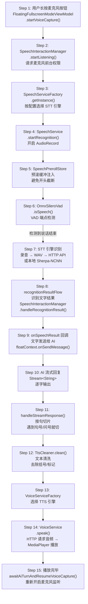

# Walkthrough: 语音输入输出完整链路

> **场景：** 用户点击麦克风按钮进入语音对话模式，说"今天天气怎么样"。语音被 STT 识别为文字，发送给 AI，AI 回复的文字被 TTS 合成为语音播放出来。从按下麦克风到语音播放完毕，经过了哪些代码。
>
> **阅读方式：** 左边打开这篇文档，右边打开 Android Studio。每一步都标注了文件路径和行号，跟着跳转。
>
> **预计时间：** 40-60 分钟（包括在 IDE 里跳转和阅读源码的时间）。

---

## 全链路总览



---

## Step 1: UI 入口 — 麦克风按钮触发语音捕获

```
📂 ui/floating/ui/fullscreen/viewmodel/FloatingFullscreenModeViewModel.kt L309
```

```kotlin
fun startVoiceCapture() {
    // L311-317: 如果 AI 正在生成，先取消
    val lastMessage = floatContext.messages.lastOrNull()
    val isAiWorking = lastMessage?.sender == "think" ||
                      (lastMessage?.sender == "ai" && lastMessage.contentStream != null)
    if (isAiWorking) {
        floatContext.onCancelMessage?.invoke()
    }
    // L319: 把控制权交给语音交互管理器
    speechManager.startListening { errorMsg ->
        aiMessage = errorMsg
    }
}
```

**这个方法从哪里被调用？** 浮窗全屏模式下，用户长按中央头像球（麦克风按钮）时触发。`FloatingFullscreenModeViewModel` 是全屏语音界面的大脑，持有 `speechManager`（语音交互管理器）和 `voiceService`（TTS 引擎）。

注意一个细节：进入语音捕获前，如果 AI 还在流式输出，先强制取消。**语音对话是独占模式**——同一时刻只有一个方向在"说话"。

> **→ 下一步：跳到 `SpeechInteractionManager.kt` L120**

---

## Step 2: 语音交互枢纽 — 请求权限与启动监听

```
📂 ui/floating/voice/SpeechInteractionManager.kt L120-188
```

```kotlin
fun startListening(onStartFailure: ((String) -> Unit)? = null) {
    // L121-124: 必须先获得焦点（窗口焦点，用于输入法控制）
    if (!hasFocus) {
        onStartFailure?.invoke(context.getString(R.string.floating_cannot_get_focus))
        return
    }

    // L130-134: 重置文本状态，消费掉唤醒词快照
    isRecording = true
    wakePhraseSnapshot = SpeechPrerollStore.consumePendingWakePhrase()
    onStateChange(context.getString(R.string.floating_listening))

    coroutineScope.launch {
        // L141-143: 确保麦克风前台服务在运行（避免后台被系统杀死）
        AIForegroundService.ensureMicrophoneForeground(context, forceStart = true)

        // L147-150: 发送 ACTION_PREPARE_WAKE_HANDOFF，让唤醒词监听停止并释放麦克风
        context.startService(Intent(context, AIForegroundService::class.java).apply {
            action = AIForegroundService.ACTION_PREPARE_WAKE_HANDOFF
        })

        // L155: 等 180ms，让唤醒词服务有时间释放麦克风
        delay(180)

        // L157-169: 最多重试 12 次（每次间隔 160ms），等待麦克风可用
        var ok = false
        var attempt = 0
        while (!ok && attempt < 12) {
            if (attempt > 0) delay(160)
            ok = speechService.startRecognition(
                languageCode = "zh-CN",
                continuousMode = true,
                partialResults = true
            )
            attempt++
        }
    }
}
```

**为什么要重试？** 麦克风在同一时刻只能被一个进程使用。如果唤醒词监听（后台运行）还没来得及释放麦克风，`AudioRecord.startRecording()` 就会失败。所以最多等待 `12 × 160ms = 约 2 秒`，直到拿到麦克风。

**`wakePhraseSnapshot`** 记录下唤醒词的文本（比如"小 O 小 O"），后续识别结果会自动去掉这段前缀，避免识别文字里多出一段唤醒词。

> **→ 下一步：进入 `SpeechServiceFactory.getInstance()`，同目录 `api/speech/SpeechServiceFactory.kt` L173**

---

## Step 3: 工厂选择 STT 引擎

```
📂 api/speech/SpeechServiceFactory.kt L173-210
```

```kotlin
fun getInstance(context: Context): SpeechService {
    val prefs = SpeechServicesPreferences(context)
    val selectedType = runBlocking { prefs.sttServiceTypeFlow.first() }

    val needNewInstance = instance == null || selectedType != currentType

    if (needNewInstance) {
        instance?.shutdown()
        val created = try {
            createSpeechService(context)   // 按 selectedType 创建
        } catch (e: IllegalStateException) {
            null
        }
        if (created != null) {
            instance = created
            currentType = selectedType
        }
    }
    return instance!!
}
```

工厂是单例模式，同一类型的引擎只初始化一次。`createSpeechService()` 内部（L54-81）根据 `SpeechServiceType` 枚举选择具体实现：

| `SpeechServiceType` | 实现类 | 说明 |
|---|---|---|
| `SHERPA_NCNN` | `SherpaSpeechProvider` | 本地离线，bundled 模型 |
| `OPENAI_STT` | `OpenAISttProvider` | Whisper API（或兼容接口） |
| `DEEPGRAM_STT` | `DeepgramSttProvider` | Deepgram 云端 API |

默认引擎是 `SHERPA_NCNN`（不需要网络、不需要 API Key）。本文档以 `OpenAISttProvider` 为主讲解，因为它展示了最完整的录音 → VAD → 上传流程。

> **→ 下一步：跳到 `api/speech/OpenAISttProvider.kt` L132**

---

## Step 4: 开启 AudioRecord 录音

```
📂 api/speech/OpenAISttProvider.kt L132-200
```

```kotlin
override suspend fun startRecognition(
    languageCode: String,
    continuousMode: Boolean,
    partialResults: Boolean,
): Boolean {
    // L152-163: 创建 AudioRecord，采样率 16000Hz，单声道，PCM_16BIT
    val minBufferSize = AudioRecord.getMinBufferSize(SAMPLE_RATE, CHANNEL_CONFIG, AUDIO_FORMAT)
    val record = AudioRecord(
        MediaRecorder.AudioSource.VOICE_COMMUNICATION,  // 系统会做回声消除
        SAMPLE_RATE,         // 16000 Hz
        CHANNEL_CONFIG,      // CHANNEL_IN_MONO
        AUDIO_FORMAT,        // ENCODING_PCM_16BIT
        minBufferSize * 2,
    )

    // L165-166: 创建临时 WAV 文件，先写 44 字节空白头（后续回填）
    val file = File(context.cacheDir, "openai_stt_${UUID.randomUUID()}.wav")
    val stream = FileOutputStream(file)
    stream.write(ByteArray(WAV_HEADER_SIZE))  // 44 字节占位

    // L171-178: 从 PrerollStore 取出预存音频，写到 WAV 文件开头
    val pendingPcm = SpeechPrerollStore.consumePending()
    if (pendingPcm != null && pendingPcm.isNotEmpty()) {
        writePcm16le(stream, pendingPcm, pendingPcm.size)
    }

    record.startRecording()
    _recognitionState.value = SpeechService.RecognitionState.RECOGNIZING
```

**两个关键设计：**

1. **`VOICE_COMMUNICATION` 音频源**：Android 会自动对这个来源做噪声消除和回声消除，适合语音识别场景。比 `MIC` 来源干净得多。

2. **WAV 头先写占位符**：WAV 格式要求在文件开头写入文件大小，但录音时还不知道最终大小。这里先写 44 字节空 bytes，停止录音后在 `writeWavHeader()`（L503）里用 `RandomAccessFile` 回头填写真实大小。

> **→ 下一步：PrerollStore 是什么？跳到 `api/speech/SpeechPrerollStore.kt`**

---

## Step 5: 技术亮点 1 — PrerollStore 预滚缓冲

```
📂 api/speech/SpeechPrerollStore.kt L10-152
```

**问题：** 用户开始说话时，VAD 需要积累几帧才能确认"这是语音"。在 VAD 确认之前，这段音频如果不保存就丢失了，识别结果里就会缺失开头的字。

**解决方案：** `SpeechPrerollStore` 是一个全局的环形缓冲区，**始终在后台存储最近 2500ms 的音频**。

```kotlin
object SpeechPrerollStore {
    private const val SAMPLE_RATE = 16000
    private const val CAPACITY_MS = 2500              // 缓存 2.5 秒音频

    private val capacitySamples: Int = (SAMPLE_RATE * CAPACITY_MS) / 1000  // 40000 个采样点
    private val ring: ShortArray = ShortArray(capacitySamples)  // 环形缓冲区

    private var writePos: Int = 0   // 写指针
    private var filled: Int = 0     // 已填充量

    // L32-46: 录音循环每次读到数据都调用这里，持续写入环形缓冲
    fun appendPcm(pcm: ShortArray, length: Int) {
        synchronized(lock) {
            // 环形写入：写到末尾就从头开始
            var idx = 0
            while (idx < n) {
                val toCopy = minOf(n - idx, capacitySamples - writePos)
                System.arraycopy(pcm, idx, ring, writePos, toCopy)
                writePos += toCopy
                if (writePos >= capacitySamples) writePos = 0
                filled = minOf(capacitySamples, filled + toCopy)
                idx += toCopy
            }
        }
    }

    // L48-79: 捕获当前缓冲区的最近 windowMs 毫秒音频，暂存为 pending
    fun capturePending(windowMs: Int = 1600) { ... }

    // L99-103: 解锁 pending，允许被消费
    fun armPending() {
        synchronized(lock) {
            pendingArmed = pending != null
        }
    }

    // L81-97: 消费 pending（最多保存 10 秒，超时自动失效）
    fun consumePending(maxAgeMs: Long = 10_000L): ShortArray? { ... }
}
```

**完整的使用时序：**

```
平时录音时：  appendPcm() → 数据持续写入环形缓冲
用户说"小O": capturePending() → 把最近 1.6s 截图存入 pending
确认唤醒：    armPending()     → 解锁 pending，允许被消费
正式录音开始：consumePending() → 取出 pending，写到 WAV 文件开头
```

这样，即使 VAD 晚了 300ms 才确认语音开始，开头那段音频已经从环形缓冲里拿到了。

> **→ 下一步：录音循环里的 VAD 检测。回到 `OpenAISttProvider.kt` L195-300**

---

## Step 6: 技术亮点 2 — Silero VAD 端点检测

```
📂 api/speech/OpenAISttProvider.kt L192-303
```

录音主循环里，每 512 个采样点（约 32ms）调用一次 VAD：

```kotlin
val audioBuffer = ShortArray(1024)
val vadFrameSize = 512
val vadFrame = ShortArray(vadFrameSize)
var vadFramePos = 0
var speechActive = false

while (isActive && _recognitionState.value == RECOGNIZING) {
    val read = record.read(audioBuffer, 0, audioBuffer.size)
    if (read > 0) {
        SpeechPrerollStore.appendPcm(audioBuffer, read)  // 持续喂给环形缓冲
        updateVolumeLevel(audioBuffer, read)              // 更新音量 UI

        // 把 read 到的数据按 512 帧分组喂给 VAD
        var idx = 0
        while (idx < read) {
            // ... 组装 vadFrame ...
            if (vadFramePos == vadFrameSize) {
                val isSpeech = vadInstance.isSpeech(vadFrame)   // ← 关键调用

                if (!speechActive) {
                    if (isSpeech) {
                        speechActive = true
                        flushPreRoll(stream)     // 把本地 preRoll 缓冲写入 WAV
                        writePcm16le(stream, vadFrame, vadFrameSize)
                    } else {
                        appendToPreRoll(vadFrame, vadFrameSize)  // 还没检测到语音，先缓存
                    }
                } else {
                    if (isSpeech) {
                        writePcm16le(stream, vadFrame, vadFrameSize)  // 继续写入
                    } else if (!autoStopTriggered) {
                        autoStopTriggered = true
                        scope.launch { stopRecognition() }  // 检测到静音→停止录音
                        return@launch
                    }
                }
                vadFramePos = 0
            }
        }
    }
}
```

**VAD 的工作方式（跳到 `api/speech/OnnxSileroVad.kt`）：**

```
📂 api/speech/OnnxSileroVad.kt L15-330
```

```kotlin
class OnnxSileroVad(
    context: Context,
    private val sampleRate: Int = 16000,
    private val frameSize: Int = 512,
    private val mode: Mode = Mode.NORMAL,   // 阈值 0.5
    speechDurationMs: Int = 50,             // 需连续 50ms 才算"语音开始"
    silenceDurationMs: Int = 300,           // 连续 300ms 静音才算"说完了"
    modelAssetPath: String = "models/silero_vad.onnx",
)
```

核心推理在 `isSpeech()` 方法（L169）：

```kotlin
fun isSpeech(frame: ShortArray): Boolean {
    // L173: Short → Float，归一化到 [-1, 1]
    val audio = FloatArray(frameSize) { i -> frame[i] / 32768.0f }

    // L174-181: 拼接上一帧的 64 个采样点作为上下文（Silero 模型需要）
    val modelInput = FloatArray(contextSize + frameSize)
    System.arraycopy(audioContext, 0, modelInput, 0, contextSize)
    System.arraycopy(audio, 0, modelInput, contextSize, frameSize)

    // L185: ONNX 推理，返回 0-1 的语音概率
    val prob = predictProbability(modelInput)
    val isSpeechFrame = prob > threshold()  // NORMAL 模式阈值 = 0.5

    // L192: 用连续帧计数做平滑，避免单帧噪声误判
    return isContinuousSpeech(isSpeechFrame)
}
```

`isContinuousSpeech()`（L195）用两个计数器做状态机：
- `speechFramesCount`：连续语音帧数，超过 `maxSpeechFramesCount`（约 3 帧 = 50ms）才输出 `true`
- `silenceFramesCount`：连续静音帧数，超过 `maxSilenceFramesCount`（约 9 帧 = 300ms）才输出 `false`

这个平滑机制避免了单帧噪声被误判为语音结束，也避免短暂停顿（如换气）截断句子。

> **→ 下一步：VAD 检测到静音 → 停止录音 → 上传识别。跳到 `OpenAISttProvider.kt` L323**

---

## Step 7: STT 识别 — 录音停止后上传

```
📂 api/speech/OpenAISttProvider.kt L323-360
```

```kotlin
override suspend fun stopRecognition(): Boolean {
    _recognitionState.value = SpeechService.RecognitionState.PROCESSING

    // L329: 停止 AudioRecord，写入 WAV 头，返回完整 WAV 文件
    val file = withContext(Dispatchers.IO) { stopRecordingInternal(deleteFile = false) }

    // L344-346: 上传 WAV 文件到 Whisper API
    val text = withContext(Dispatchers.IO) {
        transcribeWavFile(file, languageCode = lastLanguageCode)
    }

    // L350: 发布最终识别结果
    _recognitionResult.value = SpeechService.RecognitionResult(
        text = text,
        isFinal = true,
        confidence = 0f
    )
    _recognitionState.value = SpeechService.RecognitionState.IDLE
}
```

`transcribeWavFile()` 在 L559：

```kotlin
private fun transcribeWavFile(file: File, languageCode: String?): String {
    val bodyBuilder = MultipartBody.Builder().setType(MultipartBody.FORM)
    bodyBuilder.addFormDataPart("file", file.name, file.asRequestBody("audio/wav".toMediaType()))
    bodyBuilder.addFormDataPart("model", model)           // "whisper-1"
    bodyBuilder.addFormDataPart("language", "zh")          // 简体中文
    bodyBuilder.addFormDataPart("response_format", "json")

    val request = Request.Builder()
        .url(endpointUrl)                                  // Whisper API 端点
        .post(bodyBuilder.build())
        .addHeader("Authorization", "Bearer $apiKey")
        .build()

    val response = httpClient.newCall(request).execute()
    val json = JSONObject(response.body?.string() ?: "")
    return json.optString("text", "")  // 返回识别文字
}
```

识别结果（"今天天气怎么样"）通过 `_recognitionResult` StateFlow 发布出去。

> **→ 下一步：识别结果怎么被上层收到？跳回 `SpeechInteractionManager.kt` L213**

---

## Step 8: 识别结果传递 — Flow 到回调

```
📂 ui/floating/voice/SpeechInteractionManager.kt L213-303
```

`SpeechInteractionManager` 的调用者（`FloatingFullscreenModeViewModel`）负责订阅 `recognitionResultFlow` 并调用 `handleRecognitionResult()`：

```kotlin
// FloatingFullscreenModeViewModel 内部，订阅识别结果 Flow（由屏幕层通过 collectLatest 触发）
fun handleRecognitionResult(resultText: String, isFinal: Boolean, autoSendSilence: Boolean = false) {
    // L214: 去掉唤醒词前缀（如"小O小O"）
    val effectiveText = stripWakePhrasePrefixIfNeeded(resultText)

    if (isRecording) {
        if (effectiveText.isNotBlank()) {
            // 增量拼接：Sherpa-NCNN 可能会连续输出部分结果
            if (latestPartialText.isNotEmpty() && !effectiveText.startsWith(latestPartialText)) {
                accumulatedText += "。" + latestPartialText
            }
            latestPartialText = effectiveText

            // L224-229: 静默 2 秒后自动发送（仅用于 Sherpa-NCNN 的自动端点检测）
            if (autoSendSilence) {
                silenceTimeoutJob?.cancel()
                silenceTimeoutJob = coroutineScope.launch {
                    delay(2000)
                    finalizeSpeechInput()
                }
            }
        }
        userMessage = accumulatedText + latestPartialText
    } else if (isProcessingSpeech && isFinal) {
        // L235-238: 录音已停止，收到最终结果，直接发送
        timeoutJob?.cancel()
        accumulatedText += effectiveText
        finalizeSpeechInput()
    }
}
```

`finalizeSpeechInput()`（L287）：

```kotlin
private fun finalizeSpeechInput() {
    isProcessingSpeech = false
    val text = userMessage.ifBlank { accumulatedText }

    if (text.isNotBlank()) {
        onSpeechResult(text, true)  // ← 回调给 FloatingFullscreenModeViewModel
        onStateChange(context.getString(R.string.floating_thinking_2))
    }

    userMessage = ""
    accumulatedText = ""
    latestPartialText = ""
}
```

> **→ 下一步：onSpeechResult 回调发送 AI 请求。跳回 `FloatingFullscreenModeViewModel.kt` L89**

---

## Step 9: 发送给 AI

```
📂 ui/floating/ui/fullscreen/viewmodel/FloatingFullscreenModeViewModel.kt L89-106
```

```kotlin
val speechManager = SpeechInteractionManager(
    context = context,
    coroutineScope = coroutineScope,
    onSpeechResult = { text, _ ->
        val finalText = text.trim()
        if (finalText.isNotEmpty()) {
            aiMessage = context.getString(R.string.floating_thinking)
            coroutineScope.launch {
                startVoiceAvatarThinking()           // 触发头像"思考"动画
                prepareVoiceCaptureForAiTurn()       // 暂停麦克风监听
                maybeAutoAttachByKeyword(finalText)  // 关键词自动附加上下文
                floatContext.onSendMessage?.invoke(finalText, PromptFunctionType.VOICE)  // ← 发给 AI
                awaitAiTurnAndResumeVoiceCapture()   // 等 AI 回复完后重新开启麦克风
            }
        }
    },
    ...
)
```

`floatContext.onSendMessage` 最终调用的是 `ChatViewModel.sendUserMessage()`（参见 chat-message-flow.md），走完整的 AI 处理链路——这就是两个 Walkthrough 的接口点。

`PromptFunctionType.VOICE` 会在 System Prompt 构建时产生影响，告诉 AI"这是语音模式的对话，回复要简洁、口语化"。

> **→ 下一步：AI 流式回复到达。跳到 `FloatingFullscreenModeViewModel.kt` L237**

---

## Step 10-11: 技术亮点 3 — 流式 TTS 按句切片

```
📂 ui/floating/ui/fullscreen/viewmodel/FloatingFullscreenModeViewModel.kt L237-260
```

AI 回复是流式的（每次几个字），TTS 不等完整回复，按句子边界边生成边播放：

```kotlin
private suspend fun handleStreamResponse(stream: Stream<String>, cleaners: List<String>) {
    val sb = StringBuilder()
    var isFirstSentence = true
    var isFirstChar = true
    // 切句边界：强边界符。注意逗号不在里面，避免语气被过度打断。
    val endChars = ".!?;:。！？；：\n"

    XmlTextProcessor.processStreamToText(stream).collect { char ->
        if (isFirstChar) {
            aiMessage = ""   // 第一个字到达时才清空"思考中..."提示
            isFirstChar = false
        }
        aiMessage += char
        sb.append(char)

        // 遇到强句末符，或积累了 50 个字，就切出一句发给 TTS
        if (char in endChars || sb.length >= 50) {
            if (trySpeak(sb.toString(), isFirstSentence, cleaners, armMicSuppression = isFirstSentence)) {
                isFirstSentence = false
                sb.clear()   // 清空缓冲，开始下一句
            }
        }
    }
    // 流结束后，把剩余的零散文字也发给 TTS
    trySpeak(sb.toString(), isFirstSentence, cleaners, armMicSuppression = isFirstSentence)
}
```

**为什么逗号不切句？** 中文逗号表示"语气未完"，在逗号处切断会让 TTS 播放的语气很奇怪（比如"今天天气，/（停顿）/比较晴朗"）。只在句号、问号、感叹号等强边界处切，TTS 播放起来更自然。

**`isFirstSentence = true` 的作用：** 第一句 TTS 要打断任何之前可能残留的播放（`interrupt = true`），后续句子追加播放（`interrupt = false`）。

> **→ 下一步：文本清洗，跳到 `util/TtsCleaner.kt`**

---

## Step 12: 文本清洗 — TtsCleaner

```
📂 util/TtsCleaner.kt L1-71
```

```kotlin
fun cleanTextForTts(text: String, regexs: List<String>): String {
    return WaifuMessageProcessor.cleanContentForWaifu(TtsCleaner.clean(text, regexs))
}
```

`TtsCleaner.clean()` 把一组正则逐一应用到文本上：

```kotlin
fun clean(text: String, regexPatterns: List<String>): String {
    var cleanedText = text
    regexPatterns.forEach { pattern ->
        if (pattern.isNotBlank()) {
            val regex = Regex(pattern)
            cleanedText = cleanedText.replace(regex, "")
        }
    }
    return cleanedText
}
```

默认正则（在 `SpeechServicesPreferences.kt` L91-94 定义）：

```kotlin
val DEFAULT_TTS_CLEANER_REGEXS = listOf(
    "\\([^)]+\\)",   // 英文括号内容：(笑) → 删掉
    "（[^）]+）"      // 中文括号内容：（思考中）→ 删掉
)
```

这样 AI 回复里的动作描述（表情包格式）就不会被 TTS 念出来。

> **→ 下一步：选择 TTS 引擎，跳到 `api/voice/VoiceServiceFactory.kt` L31**

---

## Step 13: TTS 工厂选择引擎

```
📂 api/voice/VoiceServiceFactory.kt L31-85
```

```kotlin
fun createVoiceService(context: Context): VoiceService {
    val prefs = SpeechServicesPreferences(context)
    return runBlocking {
        val type = prefs.ttsServiceTypeFlow.first()

        when (type) {
            VoiceServiceType.SIMPLE_TTS     -> SimpleVoiceProvider(context)
            VoiceServiceType.HTTP_TTS       -> HttpVoiceProvider(context).apply { setConfiguration(httpConfig) }
            VoiceServiceType.OPENAI_WS_TTS  -> OpenAIRealtimeVoiceProvider(context, ...)
            VoiceServiceType.SILICONFLOW_TTS -> SiliconFlowVoiceProvider(context, ...)
            VoiceServiceType.MINIMAX_TTS    -> MiniMaxVoiceProvider(context, ...)
            VoiceServiceType.OPENAI_TTS     -> OpenAIVoiceProvider(context, ...)
        }
    }
}
```

| `VoiceServiceType` | 实现类 | 特点 |
|---|---|---|
| `SIMPLE_TTS` | `SimpleVoiceProvider` (Android TextToSpeech) | 无需网络，免费，音质较差 |
| `HTTP_TTS` | `HttpVoiceProvider` | 通用 HTTP 接口，支持自定义接口 |
| `OPENAI_TTS` | `OpenAIVoiceProvider` | OpenAI TTS API，音质好 |
| `OPENAI_WS_TTS` | `OpenAIRealtimeVoiceProvider` | OpenAI Realtime WebSocket，超低延迟 |
| `SILICONFLOW_TTS` | `SiliconFlowVoiceProvider` | 硅基流动 |
| `MINIMAX_TTS` | `MiniMaxVoiceProvider` | MiniMax |

以 `HttpVoiceProvider` 为例讲解 TTS 流程（它是通用实现，其他引擎原理相同）。

> **→ 下一步：跳到 `api/voice/HttpVoiceProvider.kt` L237**

---

## Step 14: TTS 播放 — 生产者/消费者双队列

```
📂 api/voice/HttpVoiceProvider.kt L237-305
```

`HttpVoiceProvider` 内部有两条并发流水线（L146-171 的 `init` 块中启动）：

```kotlin
init {
    // 生产者协程：从 speakQueue 取请求 → 发 HTTP 请求获取音频文件
    speakScope.launch {
        for (request in speakQueue) {
            val prepared = fetchAudioFile(request)
            if (prepared != null) playbackQueue.send(prepared)
        }
    }

    // 消费者协程：从 playbackQueue 取音频文件 → MediaPlayer 播放
    speakScope.launch {
        for (prepared in playbackQueue) {
            playPreparedRequest(prepared)
        }
    }
}
```

**`speak()` 方法**（L237）把请求入队：

```kotlin
override suspend fun speak(text: String, interrupt: Boolean, ...): Boolean {
    if (interrupt) {
        clearForInterrupt()  // 清空两个队列，取消当前播放
    }

    val request = SpeakRequest(
        text = text,
        generation = stopGeneration.get(),
        completion = CompletableDeferred()
    )
    speakQueue.send(request)      // 入队给生产者
    return request.completion.await()  // 挂起等待播放完成
}
```

**流水线设计的好处：** 当上层按句切片发来多个 `speak()` 调用时，生产者已经在为第 2 句下载音频，消费者正在播放第 1 句。网络延迟被完全隐藏在播放时间里，实现近乎无缝的流式播放。

`fetchAudioFile()` 的核心是 HTTP 请求音频：

```kotlin
private suspend fun fetchAudioFile(request: SpeakRequest): PreparedRequest? {
    // 构建 URL/Body（支持 GET 和 POST 两种方式，{text} 占位符替换）
    // 下载音频到本地缓存文件
    // 返回 PreparedRequest（含 audioFile）
}
```

播放通过 `MediaPlayer`，设置 `AudioAttributes.USAGE_MEDIA` 让系统的音量键能控制播放音量。

> **→ 下一步：播放完毕，恢复麦克风监听。跳回 `FloatingFullscreenModeViewModel.kt` L152**

---

## Step 15: 循环闭合 — AI 说完重新开始监听

```
📂 ui/floating/ui/fullscreen/viewmodel/FloatingFullscreenModeViewModel.kt L152-176
```

```kotlin
private fun awaitAiTurnAndResumeVoiceCapture() {
    if (!isWaveActive || !shouldResumeVoiceCaptureAfterAiTurn) return
    resumeVoiceCaptureJob?.cancel()
    resumeVoiceCaptureJob = coroutineScope.launch {
        delay(120)
        var observedAiBusy = false
        while (isActive && isWaveActive && shouldResumeVoiceCaptureAfterAiTurn) {
            val busy = isAiBusyOrSpeaking()   // AI 在生成 OR TTS 在播放
            if (busy) observedAiBusy = true
            if (observedAiBusy && !busy) {
                // AI 说完了！
                shouldResumeVoiceCaptureAfterAiTurn = false
                isVoiceCapturePausedForAi = false
                lastVoiceActivityAtMs = System.currentTimeMillis()
                if (!speechManager.isRecording && !speechManager.isProcessingSpeech) {
                    startVoiceCapture()   // ← 重新开始监听用户说话
                }
                return@launch
            }
            delay(120)   // 每 120ms 轮询一次
        }
    }
}
```

`isAiBusyOrSpeaking()` 同时检查两个条件：
- AI 还在生成回复（`lastMessage.contentStream != null`）
- TTS 还在播放（`voiceService.isSpeaking`）

只有两个条件都为 `false` 时，才重新开启麦克风，等待用户说下一句话。至此，整个"说话 → 识别 → AI 思考 → TTS 播放 → 再次说话"的对话闭环完成。

---

## 完整调用链回顾

```
用户长按麦克风
│
├─ Step 1:  FloatingFullscreenModeViewModel.startVoiceCapture()   [L309] 取消 AI 生成
├─ Step 2:  SpeechInteractionManager.startListening()             [L120] 请求权限，重试拿麦克风
├─ Step 3:  SpeechServiceFactory.getInstance()                    [L173] 单例工厂选引擎
├─ Step 4:  SpeechService.startRecognition()                      [L132] 开 AudioRecord
│   ├─ Step 5:  SpeechPrerollStore.consumePending()               [L81]  注入预滚音频
│   └─ Step 6:  OnnxSileroVad.isSpeech() × N帧                   [L169] VAD 端点检测
├─ Step 7:  stopRecognition() → transcribeWavFile()               [L323] WAV → Whisper API
├─ Step 8:  recognitionResultFlow → handleRecognitionResult()     [L213] 文字结果传递
├─ Step 9:  floatContext.onSendMessage()                          [L101] 发送给 AI
│   └─ （AI 处理链路见 chat-message-flow.md）
├─ Step 10: Stream<String> 流式回复到达
├─ Step 11: handleStreamResponse() 按句切片                       [L237] 遇句末符就切
├─ Step 12: TtsCleaner.clean() 文本清洗                          [L16]  去括号内容
├─ Step 13: VoiceServiceFactory.getInstance()                    [L97]  TTS 引擎选择
├─ Step 14: VoiceService.speak() → 双队列流水线 → MediaPlayer 播放  [L237]
└─ Step 15: awaitAiTurnAndResumeVoiceCapture() → startVoiceCapture() [L152] 闭环
```

---

## 涉及文件

| 文件 | 职责 |
|------|------|
| `ui/floating/ui/fullscreen/viewmodel/FloatingFullscreenModeViewModel.kt` | 全屏语音模式主控：状态管理、TTS 切片、AI 轮次协调 |
| `ui/floating/voice/SpeechInteractionManager.kt` | 语音交互枢纽：麦克风权限、结果累积、静默超时 |
| `api/speech/SpeechServiceFactory.kt` | STT 引擎工厂（单例，按配置路由） |
| `api/speech/OpenAISttProvider.kt` | Whisper API STT：录音 + VAD + 上传 |
| `api/speech/SherpaSpeechProvider.kt` | 本地 Sherpa-NCNN STT：离线识别 |
| `api/speech/OnnxSileroVad.kt` | Silero VAD：ONNX 端点检测模型 |
| `api/speech/SpeechPrerollStore.kt` | 预滚缓冲：环形缓冲区，防语音开头丢失 |
| `api/voice/VoiceServiceFactory.kt` | TTS 引擎工厂（单例，按配置路由） |
| `api/voice/HttpVoiceProvider.kt` | 通用 HTTP TTS：双队列流水线 + MediaPlayer |
| `api/voice/OpenAIVoiceProvider.kt` | OpenAI TTS API |
| `api/voice/AccessibilityVoiceProvider.kt` (SimpleVoiceProvider) | Android TextToSpeech |
| `util/TtsCleaner.kt` | 正则清洗：去除 TTS 不应念出的括号内容 |
| `data/preferences/SpeechServicesPreferences.kt` | 语音配置：引擎类型、API Key、清洗正则 |

---

## 动手练习

### 练习 1: 观察 VAD 决策

在 `OnnxSileroVad.kt:186` 加日志：

```kotlin
val isSpeechFrame = prob > threshold()
Log.d("VAD", "prob=$prob, isSpeech=$isSpeechFrame, speechFrames=$speechFramesCount, silenceFrames=$silenceFramesCount")
```

然后说一句话，观察 logcat 里概率值的变化——你会看到说话时概率接近 1.0，停止时迅速跌到 0.1 以下，然后 `silenceFramesCount` 开始计数到阈值。

### 练习 2: 验证 PrerollStore 效果

临时改 `OpenAISttProvider.kt:171`，不消费 PrerollStore：

```kotlin
// val pendingPcm = SpeechPrerollStore.consumePending()
val pendingPcm: ShortArray? = null  // 强制禁用
```

用唤醒词触发对话，观察识别结果是否少了开头几个字。

### 练习 3: 调整 TTS 切片粒度

在 `FloatingFullscreenModeViewModel.kt:252` 修改切句条件：

```kotlin
// 把 50 改成 20，让 TTS 更频繁切片
if (char in endChars || sb.length >= 20) {
```

观察 TTS 播放是否更"碎"，延迟是否变低，以及语气是否变得奇怪。

### 练习 4: 观察双队列流水线

在 `HttpVoiceProvider.kt:148`（生产者）和 `HttpVoiceProvider.kt:163`（消费者）各加一行日志：

```kotlin
// 生产者
Log.d("HttpTTS", "[生产] 开始下载: ${request.text.take(10)}")
// 消费者
Log.d("HttpTTS", "[消费] 开始播放: ${prepared.request.text.take(10)}")
```

让 AI 回复一段较长的内容，观察"下载第 2 句"和"播放第 1 句"是否并发执行。

---

## 关联文档

| 文档 | 关系 |
|------|------|
| `chat-message-flow.md` | 上游链路——Step 9 之后 AI 的处理流程 |
| `cold-start.md` | 应用启动，理解 `AIForegroundService` 初始化时机 |
| `38_Runtime.一次对话完整生命周期.md` | 对话生命周期宏观视角 |
