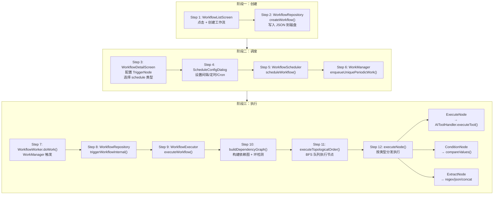

# Walkthrough: 工作流从创建到定时执行

> **场景：** 用户在工作流页面创建一个"每小时备份日志"的工作流，配置定时触发器。WorkManager 在后台按时触发，WorkflowExecutor 按拓扑顺序执行节点图。从创建到执行完毕，经过了哪些代码。
>
> **预计时间：** 30-40 分钟。

---

## 全链路总览



---

## 阶段一：创建

### Step 1: 工作流列表页面

```
📂 ui/features/workflow/screens/WorkflowListScreen.kt L49, L289
```

用户点击 "+" 按钮，弹出 `CreateWorkflowDialog`：

```kotlin
CreateWorkflowDialog(
    onDismiss = { showCreateDialog = false },
    onCreate = { name, description ->
        viewModel.createWorkflow(name, description) { workflow ->
            onNavigateToDetail(workflow.id)  // 创建后跳转到详情页
        }
    }
)
```

### Step 2: 持久化到磁盘

```
📂 data/repository/WorkflowRepository.kt L235
```

```kotlin
suspend fun createWorkflow(workflow: Workflow) {
    // 写入 JSON 文件
    // 路径：Downloads/Operit/workflow/<id>.json
    val file = File(workflowDir, "${workflow.id}.json")
    file.writeText(json.encodeToString(workflow))

    // 如果已配置定时触发器且已启用 → 立即注册调度
    if (workflow.enabled && hasScheduleTrigger(workflow)) {
        scheduleWorkflow(workflow.id)
    }
}
```

**工作流数据模型（`data/model/Workflow.kt`）：**

```kotlin
@Serializable
data class Workflow(
    val id: String,
    val name: String,
    val nodes: List<WorkflowNode>,           // 节点图
    val connections: List<WorkflowNodeConnection>, // 有向边
    val enabled: Boolean = true,
    // ... 执行统计
)

sealed class WorkflowNode {
    // 触发器节点 — 工作流入口
    data class TriggerNode(
        val triggerType: String = "manual",  // manual / schedule / tasker / intent / speech
        val triggerConfig: Map<String, String> = emptyMap()
    )
    // 执行节点 — 调用工具
    data class ExecuteNode(
        val actionType: String,              // 工具名
        val actionConfig: Map<String, ParameterValue>
    )
    // 条件节点 — if/else 分支
    data class ConditionNode(...)
    // 提取节点 — regex/json/substring
    data class ExtractNode(...)
    // 逻辑节点 — AND/OR
    data class LogicNode(...)
}
```

---

## 阶段二：调度

### Step 3-4: 配置触发器

```
📂 ui/features/workflow/screens/WorkflowDetailScreen.kt L939, L1886
```

在节点编辑区域，用户选择 `triggerType = "schedule"` 后，点击"配置定时触发"按钮：

```
📂 ui/features/workflow/components/ScheduleConfigDialog.kt L31
```

```kotlin
@Composable
fun ScheduleConfigDialog(
    initialScheduleType: String,
    initialConfig: Map<String, String>,
    onDismiss: () -> Unit,
    onConfirm: (scheduleType: String, config: Map<String, String>) -> Unit
)
```

三种调度模式：

| 模式 | 配置 | 说明 |
|------|------|------|
| `interval` | `interval_ms` | 固定间隔（最少 15 分钟） |
| `specific_time` | `specific_time` | 指定日期时间（一次性） |
| `cron` | `cron_expression` | Cron 表达式（10 个预设 + 自定义） |

### Step 5: WorkflowScheduler — 注册到 WorkManager

```
📂 core/workflow/WorkflowScheduler.kt L53
```

```kotlin
fun scheduleWorkflow(workflow: Workflow) {
    val triggerNode = workflow.nodes
        .filterIsInstance<TriggerNode>()
        .firstOrNull { it.triggerType == "schedule" } ?: return

    val config = triggerNode.triggerConfig
    val scheduleType = config["schedule_type"] ?: return
    if (config["enabled"] != "true") return

    when (scheduleType) {
        "interval" -> scheduleIntervalWorkflow(workflow.id, config, triggerNode.id)
        "specific_time" -> scheduleOneTimeWorkflow(workflow.id, config, triggerNode.id)
        "cron" -> scheduleCronWorkflow(workflow.id, config, triggerNode.id)
    }
}
```

### Step 6: WorkManager 注册

```
📂 core/workflow/WorkflowScheduler.kt L86
```

以间隔模式为例：

```kotlin
private fun scheduleIntervalWorkflow(workflowId: String, config: Map<String, String>, triggerNodeId: String) {
    val intervalMs = config["interval_ms"]?.toLongOrNull() ?: return
    val intervalMinutes = (intervalMs / 60000).coerceAtLeast(15) // WorkManager 最少 15 分钟

    val inputData = Data.Builder()
        .putString(WorkflowWorker.KEY_WORKFLOW_ID, workflowId)
        .putString(WorkflowWorker.KEY_TRIGGER_NODE_ID, triggerNodeId)
        .build()

    val workRequest = PeriodicWorkRequestBuilder<WorkflowWorker>(
        intervalMinutes, TimeUnit.MINUTES
    ).setInputData(inputData).build()

    workManager.enqueueUniquePeriodicWork(
        getWorkName(workflowId),  // "workflow_<id>"
        ExistingPeriodicWorkPolicy.REPLACE,
        workRequest
    )
}
```

**`enqueueUniquePeriodicWork`** 保证同一个工作流只有一个调度任务。`REPLACE` 策略意味着重新配置后旧任务被替换。

---

## 阶段三：执行

### Step 7: WorkflowWorker — WorkManager 触发

```
📂 core/workflow/WorkflowWorker.kt L15
```

```kotlin
class WorkflowWorker(appContext: Context, workerParams: WorkerParameters)
    : CoroutineWorker(appContext, workerParams) {

    override suspend fun doWork(): Result {
        val workflowId = inputData.getString(KEY_WORKFLOW_ID) ?: return Result.failure()
        val triggerNodeId = inputData.getString(KEY_TRIGGER_NODE_ID)

        val repository = WorkflowRepository(applicationContext)
        val result = repository.triggerWorkflow(workflowId, triggerNodeId)

        return if (result.isSuccess) Result.success() else Result.failure()
    }
}
```

### Step 8: triggerWorkflowInternal — 防并发 + 创建 Executor

```
📂 data/repository/WorkflowRepository.kt L374
```

```kotlin
private suspend fun triggerWorkflowInternal(
    workflowId: String,
    triggerNodeId: String?,
    triggerExtras: Map<String, String>,
    onNodeStateChange: ((String, NodeExecutionState) -> Unit)?
) {
    val workflow = getWorkflow(workflowId) ?: return
    if (!workflow.enabled) return

    // 防止同一工作流并发执行
    if (runningWorkflowJobs.containsKey(workflowId)) return

    updateExecutionStatus(workflowId, "RUNNING")

    // 创建 Executor 并执行
    val executor = WorkflowExecutor(context)
    val result = executor.executeWorkflow(workflow, triggerNodeId, triggerExtras, onNodeStateChange)

    // 保存执行记录
    saveExecutionRecord(result.executionRecord)
    updateExecutionStatistics(workflowId, result.success)
}
```

### Step 9-10: WorkflowExecutor — 依赖图构建

```
📂 core/workflow/WorkflowExecutor.kt L504
```

```kotlin
suspend fun executeWorkflow(
    workflow: Workflow,
    triggerNodeId: String?,
    triggerExtras: Map<String, String>,
    onNodeStateChange: ((String, NodeExecutionState) -> Unit)?
): WorkflowExecutionResult = withContext(Dispatchers.IO) {

    // Step 10a: 构建依赖图（邻接表 + 入度表）
    val (adjacencyList, inDegree) = buildDependencyGraph(workflow)

    // Step 10b: 环检测（DFS）
    if (detectCycle(adjacencyList, workflow.nodes)) {
        return@withContext WorkflowExecutionResult(success = false, message = "Cycle detected")
    }

    // 标记触发节点为 Success
    triggerNodes.forEach { node ->
        nodeResults[node.id] = NodeExecutionState.Success(triggerPayload)
    }

    // Step 11: BFS 拓扑排序执行
    executeTopologicalOrder(workflow, adjacencyList, inDegree, nodeResults, onNodeStateChange)
}
```

### Step 11: 拓扑排序执行 — BFS 队列

```
📂 core/workflow/WorkflowExecutor.kt L751
```

```kotlin
private suspend fun executeTopologicalOrder(...) {
    // 计算从触发节点可达的节点集合
    val reachable = getReachableNodeIds(triggerNodeIds, adjacencyList)

    // BFS 队列：从入度为 0 的节点开始
    val queue: Queue<String> = LinkedList()
    reachable.filter { inDegree[it] == 0 }.forEach { queue.add(it) }

    while (queue.isNotEmpty()) {
        val nodeId = queue.poll()
        val node = nodeMap[nodeId] ?: continue

        // 检查入边条件（true/false/success/error/regex）
        val shouldExecute = checkIncomingConditions(node, connections, nodeResults)

        if (shouldExecute) {
            // Step 12: 执行节点
            val result = executeNode(node, nodeResults, ...)
            nodeResults[nodeId] = result
        } else {
            nodeResults[nodeId] = NodeExecutionState.Skipped("Condition not met")
        }

        // 更新后继节点入度，入度归零的加入队列
        adjacencyList[nodeId]?.forEach { successorId ->
            inDegree[successorId] = (inDegree[successorId] ?: 1) - 1
            if (inDegree[successorId] == 0) queue.add(successorId)
        }
    }
}
```

### Step 12: executeNode — 按类型分发

```
📂 core/workflow/WorkflowExecutor.kt L1046
```

```kotlin
private suspend fun executeNode(node: WorkflowNode, ...): NodeExecutionState {
    return when (node) {
        is TriggerNode -> NodeExecutionState.Success(triggerPayload)

        is ExecuteNode -> {
            // 解析参数（静态值或引用其他节点的输出）
            val params = resolveParameters(node.actionConfig, nodeResults)
            val tool = AITool(name = node.actionType, parameters = params)

            // 调用工具系统执行
            val result = toolHandler.executeTool(tool)
            if (result.success) NodeExecutionState.Success(result.resultMessage)
            else NodeExecutionState.Failed(result.error)
        }

        is ConditionNode -> {
            val left = resolveParameterValue(node.leftValue, nodeResults)
            val right = resolveParameterValue(node.rightValue, nodeResults)
            val passed = compareValues(left, node.operator, right)
            NodeExecutionState.Success(passed.toString())
        }

        is ExtractNode -> {
            // REGEX / JSON / SUBSTRING / CONCAT / RANDOM_INT / RANDOM_STRING
            val extracted = performExtraction(node, nodeResults)
            NodeExecutionState.Success(extracted)
        }

        is LogicNode -> {
            // AND: 所有输入都是 Success
            // OR: 至少一个输入是 Success
            val passed = evaluateLogic(node.logicType, incomingResults)
            NodeExecutionState.Success(passed.toString())
        }
    }
}
```

**ExecuteNode 的核心：** `toolHandler.executeTool(tool)` 调用的是和 AI 对话中完全相同的工具系统（见 `tool-execution.md`）。工作流的 `execute_shell`、`read_file` 等工具和 AI 直接调用走的是同一条路径。

---

## App 启动时恢复调度

```
📂 core/workflow/WorkflowSchedulerInitializer.kt L17
```

```kotlin
object WorkflowSchedulerInitializer {
    fun initialize(context: Context) {
        // 在 IO 线程加载所有工作流
        CoroutineScope(Dispatchers.IO).launch {
            val workflows = repository.getAllWorkflows()
            workflows.filter { it.enabled && hasScheduleTrigger(it) }.forEach {
                repository.scheduleWorkflow(it.id)
            }
        }
    }
}
```

App 更新或强制停止后，WorkManager 的任务可能丢失。启动时重新注册所有定时工作流。

---

## 完整调用链回顾

```
创建:
WorkflowListScreen → CreateWorkflowDialog           [L289]
  → viewModel.createWorkflow(name, desc)             [ViewModel L997]
    → repository.createWorkflow(workflow)             [L235]
      → 写入 Downloads/Operit/workflow/<id>.json
      → 如有定时触发器 → scheduleWorkflow()

调度:
WorkflowDetailScreen → ScheduleConfigDialog          [L939]
  → 配置 interval / specific_time / cron             [ScheduleConfigDialog L31]
  → WorkflowScheduler.scheduleWorkflow()             [L53]
    → WorkManager.enqueueUniquePeriodicWork()         [L115]

执行:
WorkflowWorker.doWork()                               [L26]
  → repository.triggerWorkflow(id)                    [L323]
    → triggerWorkflowInternal()                        [L374]
      → WorkflowExecutor.executeWorkflow()            [L504]
        → buildDependencyGraph() + detectCycle()       [L598-601]
        → executeTopologicalOrder() — BFS 队列         [L751]
          → executeNode() 按类型分发                    [L1046]
            → ExecuteNode: toolHandler.executeTool()
            → ConditionNode: compareValues()
            → ExtractNode: regex/json/concat

涉及文件:
1. ui/features/workflow/screens/WorkflowListScreen.kt        — 列表 UI
2. ui/features/workflow/screens/WorkflowDetailScreen.kt      — 节点编辑
3. ui/features/workflow/components/ScheduleConfigDialog.kt   — 调度配置
4. data/model/Workflow.kt                                     — 数据模型
5. data/repository/WorkflowRepository.kt                      — CRUD + 触发
6. core/workflow/WorkflowScheduler.kt                         — WorkManager 注册
7. core/workflow/WorkflowWorker.kt                            — Worker 入口
8. core/workflow/WorkflowExecutor.kt                          — 图执行引擎
```

---

## 动手练习

### 练习 1: 创建一个定时工作流

创建一个每 15 分钟执行 `list_files /sdcard` 的工作流。在 `WorkflowWorker.kt:39` 加断点，等待 WorkManager 触发，观察执行过程。

### 练习 2: 观察拓扑排序

创建一个多节点工作流（触发 → 执行A → 条件判断 → 执行B/执行C）。在 `WorkflowExecutor.kt:751`（`executeTopologicalOrder`）加断点，观察 BFS 队列的处理顺序。

### 练习 3: 追踪节点参数引用

创建一个工作流：节点 A 执行 `list_files`，节点 B 用 A 的输出作为参数执行 `read_file`。在 `resolveParameters()` 加断点，观察 `NodeReference` 如何解析为实际值。

---

## 关联文档

| 文档 | 关系 |
|------|------|
| `tool-execution.md` | ExecuteNode 调用的工具系统 |
| `cold-start.md` | WorkflowSchedulerInitializer 在启动时恢复调度 |
